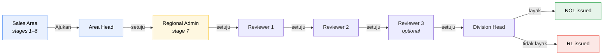
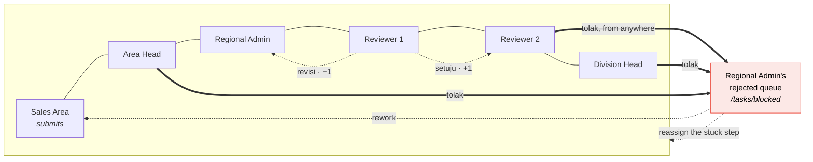

# End-to-End Walkthrough

One record, one company, walked through all 8 stages and the full approval chain
— who acts, what they do, which page they do it on, what comes out, and who's
next.

> **This is a narrative synthesis, not a canonical source.** Every fact here is
> already stated somewhere else; this document just threads it into one story.
> If anything here disagrees with a canonical doc, the canonical doc is right:
> [domain/02-process-flow.md](domain/02-process-flow.md) (stages, gates),
> [design/approval-workflow.md](design/approval-workflow.md) (the chain),
> [design/roles-permissions.md](design/roles-permissions.md) (who can do
> what), [design/frontend/13-page-role-matrix.md](design/frontend/13-page-role-matrix.md)
> (pages).

---

## In one paragraph

**Sales Area** creates a company and carries it through six stages of data entry
— Directory, Plotting, Prospect, Survey, A1, and the NOL request — saving as they
go, with two documents generated, signed outside the system and re-uploaded along
the way (KK0, A1). At the end of stage 6 they **submit**, and the record enters a
five-step approval chain: **Area Head** approves the Area's work and steps out;
**Regional Admin** completes the feasibility analysis, produces the Resume
Evaluasi, and picks 2–3 **Reviewers**; the reviewers approve in sequence; **Division
Head** makes the final call. Every step can also send the record back
(**Revisi**, one level down) or sideways to Regional Admin (**Tolak**). The record
ends in exactly one of two states: **NOL** (approved) or **RL** (refused).

---

## Part 1 — Data entry (stages 1–6), all Sales Area

Nobody else touches these six stages. The record can be saved and reopened at any
point — nothing here is a wizard that must finish in one sitting.

| # | Stage | What Sales Area does | Page | Produces | To advance |
|---|---|---|---|---|---|
| 1 | **Directory** | Registers the company: name, location, production type. **Drops a pin on the map** — mandatory from this stage on | `/directory/new` | A `company` record, `Nomor` allocated on save | Nothing blocks this — every company starts here |
| 2 | **Plotting** | Assigns the sales rep (`Plotting By`), sets `Posisi Pelanggan` (Pengembangan / Jalur Existing) and `Kawasan` | `/companies/{id}/plotting` (also inline from the `/plotting` list) | Plotting fields set | Clicks **`[ Prospect ]`** — enabled once all three fields are filled |
| 3 | **Prospect** | Records company contacts (PIC) — name and role required, social handles optional, repeatable, minimum 1 | `/companies/{id}/prospect` | One or more `company_contact` rows | Moves on when ready to schedule the survey — no hard gate |
| 4 | **Survey (KK0)** | Runs the on-site survey with no system access — fills the ~60-field **paper** KK0: products, raw materials, market orientation, operations, energy needs, the **equipment table** (gas demand per piece of equipment, `Konversi ke Gas`, typed in directly, not computed) and the 24-hour load profile — signed on the spot by **Petugas Survei and the customer**. Back at a desk, transcribes the same data into the system, which can regenerate a matching KK0 `.docx` for the internal record; the already-signed paper (commonly photographed and uploaded from the site itself) is what satisfies the gate, not a fresh signature | `/companies/{id}/survey` | Filled `survey` record + signed KK0 attachment | 🔒 **Gate:** cannot enter A1 without the **signed KK0 uploaded** |
| 5 | **A1 (Registrasi)** | Fills registration details and **pricing** (Basis Kontrak, Skema, Segment, Kode Harga, Harga — all typed by hand, no automatic lookup). Generates the A1 `.docx`, gets it signed by the customer outside the system, re-uploads it | `/companies/{id}/a1` | `a1_registration` record + signed A1 attachment | 🔒 **Gate:** cannot enter Permohonan NOL without **signed A1** + **Bukti Kelayakan** uploaded, plus the **SiGas MOM** if `Skema = SiGas` |
| 6 | **Permohonan NOL** | Fills contract volumes and pricing for the request (can copy from A1 or enter fresh), the **Lampiran 17 evaluation** narrative, Capex Pre GR3, Biaya Penyambungan, and attaches the required references. This tab covers **two documents at once**: the Evaluasi (Lampiran 17) and the Nota Dinas request (Lampiran 15) | `/companies/{id}/nol-request` | `nol_request` record | 🔒 **Gate:** A1 + KK0 + Capex Pre GR3 document all attached, **then** click **`[ Ajukan untuk Persetujuan ]`** |

Clicking **Ajukan** opens a confirmation dialog that names the chain about to be
started (who's Area Head, who's Regional Admin, that reviewers are still to be
assigned) and warns that the record **locks** — Sales Area cannot edit it again
unless it comes back via `Revisi`. Confirming moves the record from `DRAFT` to
`AREA_HEAD`, snapshots the chain, and notifies the Area Head.

---

## Part 2 — The approval chain (stages 6–8)

Five actors, in a fixed order, with three possible actions at every step. This is
the part of the system built specifically to answer *"where is this case, and who
is sitting on it"* — every approver works from **`/tasks`** (their personal
inbox), opens the record hub, and acts from there. There is no separate approval
form; the review screen **is** the record.

### The three actions, everywhere in the chain

| Action | Effect | Comment |
|---|---|---|
| **Setuju** (approve) | Moves **one step forward** in the chain | optional |
| **Revisi** (send back) | Moves **one step back** — lands on whoever is immediately behind the current actor | **required** |
| **Tolak** (reject) | Jumps **sideways, straight to Regional Admin's queue** — regardless of where the record currently is | **required** |

**Tolak is not "return to sender."** A rejected case never bounces silently back
into a sales rep's inbox — it always lands with Regional Admin, who decides
whether to rework it (sends it back to Sales Area as a fresh `DRAFT`), reassign
the stuck step to someone else, or kill the case outright.

### Step by step

| Step | Who | Page | What they can edit | Setuju → next | Revisi → back to |
|---|---|---|---|---|---|
| 1 | **Area Head** | `/tasks` → record hub | Nothing — approve/revise/reject only | Regional Admin | Sales Area (`DRAFT`) |
| 2 | **Regional Admin** | `/tasks` → **Evaluation tab** (`…/evaluation`) | **Stage 7 fields**: FEED checkpoint, final capex, pipe sizing (Pipa Induk/Service), Spesifikasi MRS, G-Size/Tekanan/Flowrate, IRR/NPV/Payback, RKAP status, payment scheme, Ketersediaan Pasokan (manual). Produces the **Resume Evaluasi**. Also picks the **2–3 Reviewers** for this case (`Tetapkan Reviewer` action) | Reviewer 1 | Area Head |
| 3 | **Reviewer 1** | `/tasks` → record hub (read-only + action bar) | Nothing — comments only | Reviewer 2 | Regional Admin |
| 4 | **Reviewer 2** | `/tasks` → record hub | Nothing | Reviewer 3 (if configured) or Division Head | Reviewer 1 |
| 5 | **Reviewer 3** *(optional)* | `/tasks` → record hub | Nothing | Division Head | Reviewer 2 |
| 6 | **Division Head** | `/tasks` → **Issuance tab** (`…/nol-issuance`) | Sets **approved terms** (may differ from what was requested), any **Kontrak Bersyarat** conditions, and the NOL validity period | **Issues NOL** or **RL** — terminal | last Reviewer |

**Area Head is a special case**: their `Setuju` here is also the *end* of their
involvement in this record. After it, they can still open the record and read
everything that happens to it, but there is no action bar for them ever again —
the endpoint is Lampiran 17, and everything past it belongs to the Region.

**Regional Admin is the only role that both edits and approves.** Every other
approver either edits nothing (Area Head, Reviewers, Division Head's data fields)
or has already finished editing before submitting (Sales Area).

### The two endings

| Outcome | Trigger | Document | Signed by |
|---|---|---|---|
| **NOL** *(No Objection Letter)* | Division Head marks the case **layak** (feasible) | Penerbitan NOL/RL — Lampiran 16 | Direktur Komersial / GM SOR |
| **RL** *(Refusal Letter)* | Division Head marks it **tidak layak** | Same document, negative outcome | Same |

Both are the same act on the same form — the workflow always ends in exactly one
of the two, never neither. Once issued, the record is terminal: no further action
is possible on it.

---

## Part 3 — A worked example

**PT Indonesia 1945**, a laundry-services company in Surabaya, walked through by
**Budi S.** (Sales Area), with **Rudi H.** as Area Head, **Sari W.** as Regional
Admin, and **Andi P.** / **Dewi** as the two reviewers Sari assigns.

| Date | Who | Page | Action |
|---|---|---|---|
| 01 Aug | Budi | `/directory/new` | Creates PT Indonesia 1945, drops the map pin. **Stage → Directory.** |
| 03 Aug | Budi | `/companies/{id}/plotting` | Sets himself as `Plotting By`, `Jalur Existing`, `Non Kawasan Industri`. Clicks **Prospect**. **Stage → Plotting → Prospect.** |
| 05 Aug | Budi | `/companies/{id}/prospect` | Adds two PICs. |
| 10 Aug | Budi | *(on-site, no system access)* | Runs the on-site survey with the customer present: fills the paper KK0, including the equipment table and the 24-hour load profile, and gets it signed by the surveyor and the customer. Photographs the signed KK0 and uploads it on the spot via the mobile attachment-upload flow. |
| 11 Aug | Budi | `/companies/{id}/survey` | Back at his desk, transcribes the paper KK0 into the survey form — equipment table, load profile, `Konversi ke Gas` typed row by row. **Stage → Survey.** Gate already satisfied by yesterday's upload. |
| 20 Aug | Budi | `/companies/{id}/a1` | Fills pricing by hand (Gold segment, USD 9.18/MMBtu). Downloads A1, customer signs it, re-uploads it. **Stage → A1.** Gate satisfied. |
| 21 Aug, 08:00 | Budi | `/companies/{id}/nol-request` | Completes the Lampiran 17 evaluation and the NOL request, attaches A1 + KK0 + Capex Pre GR3. Clicks **Ajukan**. **Record locks; enters the chain at Area Head.** |
| 24 Aug | Rudi (Area Head) | `/tasks` → record hub | Reviews, clicks **Setuju**. His involvement ends here — he can still watch, never act again on this case. |
| 25 Aug | Sari (Regional Admin) | `/tasks` → `…/evaluation` | Completes stage 7 (final capex, G-Size, IRR/NPV/Payback), produces the Resume Evaluasi, assigns Andi and Dewi as reviewers, clicks **Setuju**. |
| 27 Aug | Andi (Reviewer 1) | `/tasks` → record hub | **Setuju.** |
| 28 Aug | Dewi (Reviewer 2) | `/tasks` → record hub | **Setuju** — no Reviewer 3 configured, so it jumps straight to Division Head. |
| 29 Aug | Division Head | `/tasks` → `…/nol-issuance` | Marks the case **layak**, sets the approved terms and validity period. **NOL issued.** Record is terminal. |

Total elapsed time, start to finish: 28 days — visible the whole way on the
record's timeline and on `/reports/ageing`, which is the entire point of the
system.

---

## Quick reference — who can edit, when

| Record state | Who can edit |
|---|---|
| Stages 1–6, `DRAFT` | Sales Area (their own Area) |
| At Area Head | **Nobody** — read-only, changes only via `Revisi` |
| At Regional Admin | **Regional Admin only** — the one role that edits *and* approves |
| With any Reviewer | **Nobody** — comment only |
| At Division Head | **Nobody** — approve/reject/issue only |

**Visible ≠ actionable, throughout.** Area Head and Regional Admin can always
*see* every record in their scope, at every stage — but can only *act* at their
one step. See [design/roles-permissions.md](design/roles-permissions.md)
for the full scope/capability/turn model this all rests on.
