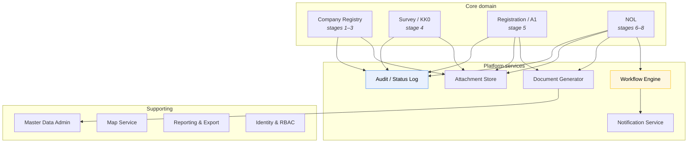
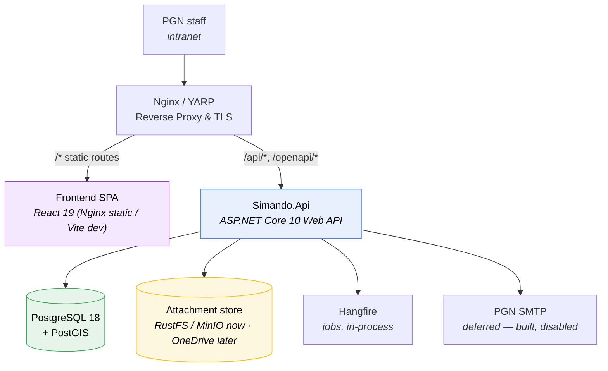

# Build — Technical Architecture

**Application name: `DMS - Simando`.**

Stack decided: **.NET 10 Web API backend + React 19 SPA frontend**, **self-hosted**. This
document works out what that means concretely.

---

## What the domain demands

The hard requirements the sources impose, before any technology choice:

| Requirement | Where it comes from |
|---|---|
| **Geospatial storage + map with manual pin-drop** | notulen (×3), decision on Q22 |
| **Document generation to .docx** | *"Yang word bisa didownload"* |
| **File storage with versioning** | 13+ upload kinds, re-uploads after Revisi, and every signature arrives as a re-upload |
| **Configurable workflow engine** | 2–3 reviewers chosen by Regional Admin |
| **Row-level security by area/region** | *"sales area spesifik hanya bisa melihat area tersebut"* |
| **Immutable audit log** | signed commercial documents |
| **Effective-dated master data** | prices and exchange rates change |
| **In-app notification** | Email is deferred; the badge and task list carry it |
| **Local identity & account management** | No access to PGN's directory |
| **Excel export** | the organisation runs on spreadsheets |
| **Self-hosted deployment** | decision on Q27 |

Nothing here needs high throughput or low latency. Hundreds of active cases,
dozens of concurrent users. It needs correctness, auditability and clear status.

---

## Stack

| Layer | Choice | Notes |
|---|---|---|
| **Backend Runtime** | **.NET 10 (LTS)** | LTS matters for an SOE handover; support runs to Nov 2028 |
| **Web API** | **ASP.NET Core 10 Web API** | RESTful controllers returning ProblemDetails RFC 7807 |
| **API Spec & Docs** | **OpenAPI 3.1** + **Scalar** | `Microsoft.AspNetCore.OpenApi` at `/openapi/v1.json`, interactive UI at `/scalar/v1` via `Scalar.AspNetCore` |
| **Frontend Runtime & Bundler** | **Bun** + **Vite 8** | Bun as package manager and script runner; Vite for fast HMR |
| **Frontend Framework** | **React 19** + **TypeScript** | Modern SPA with React 19 transitions and hooks |
| **Frontend Routing** | **@tanstack/react-router** | Type-safe file-based routing, loader data prefetching, search param validation |
| **API Client & Caching** | **openapi-typescript** + **openapi-react-query** | Schema codegen (`openapi-typescript`), `openapi-fetch`, wrapped by `openapi-react-query` & `@tanstack/react-query` v5 |
| **Data Tables & Grids** | **@tanstack/react-table** (v8) | Headless data tables for directory, inbox, audit log, and master data grids |
| **Forms & State** | **@tanstack/react-form** + **zod** | Reactive type-safe forms with nested field arrays, dirty tracking, and Zod schemas |
| **UI Components & Styling** | **shadcn/ui** + **Tailwind CSS v4** | Radix UI primitives, Lucide icons, accessible responsive components |
| **Maps** | **mapcn** (`@mapcn/map`) | MapLibre GL map components via `bunx --bun shadcn@latest add @mapcn/map` |
| **ORM** | **EF Core 10** + **Npgsql** | |
| **Object Mapping** | **Mapster v10** | High-performance DTO mapping & EF Core LINQ projection (`ProjectToType<T>()`) |
| **Database** | **PostgreSQL 18 + PostGIS** | PostGIS via **NetTopologySuite**, natively supported by Npgsql |
| **Auth** | **ASP.NET Core Identity, local accounts** | SameSite=Lax Cookie Auth, Scoped `ICurrentUser` driving EF Core RLS |
| **Background jobs** | **Hangfire** | Email queue, orphan sweep. Has a self-hosted dashboard |
| **Object storage** | **S3-compatible (RustFS / MinIO)** now, **OneDrive** when PGN grants tenant access | AWS SDK for .NET / Microsoft Graph SDK. See [storage](storage.md) |
| **Documents (.docx)** | **Open XML SDK** (`DocumentFormat.OpenXml`) — template merge | |
| **Excel export** | **ClosedXML** (MIT) | Not EPPlus — its licence is non-commercial since v5 |
| **Validation** | **FluentValidation** (Backend) + **Zod** (Frontend) | Consistent server & client validation rules |
| **Logging** | **Serilog** → files + Seq/ELK | |
| **Email** | **MailKit** — *built but disabled* | Email is deferred |
| **Testing** | **xUnit** + **Testcontainers** (Backend) · **Vitest** + **Playwright** (Frontend/E2E) | |

### Headless Web API + React SPA Architecture

Decoupling the frontend into a standalone React 19 SPA powered by the TanStack ecosystem and a headless .NET 10 Web API provides several distinct advantages:

- **Type-Safe Contract Synchronization:** The backend serves an OpenAPI 3.1 specification at `/openapi/v1.json`. Running `bun run codegen` in the frontend invokes `openapi-typescript` to generate static TypeScript types (`src/api/schema.d.ts`), which `openapi-react-query` binds to `$api.useQuery` and `$api.useMutation` with zero manual boilerplate.
- **Client-Side Responsiveness & State Management:** TanStack Router provides file-based routing and deep link search param state. TanStack Query manages cache invalidation, background refetching, and optimistic updates.
- **Complex Multi-Step Form Management:** Heavy forms like Survey KK0 (~60 fields with dynamic equipment tables) and A1 Customer Registration benefit from `@tanstack/react-form`'s fine-grained field reactivity and Zod validation schemas without round-trip server latency.
- **Rich Geospatial UX:** `mapcn` integrates MapLibre GL seamlessly with Tailwind and React, supporting interactive pin-drops, spatial coordinate extraction, and reverse geocoding directly in the browser.
- **Secure Server-Side RBAC & Row-Level Security:** Authentication uses SameSite=Lax HTTP-only cookies. Every API request resolves a scoped `ICurrentUser`, so EF Core global query filters enforce Area/Region data scoping seamlessly across all queries.

---

## Solution structure

```
Simando.sln
├─ src/
│  ├─ Simando.Domain/            entities, enums, value objects, domain rules
│  │                             — NO EF Core dependency, deliberately
│  │  ├─ Organisation/             Region, Area — scope boundaries
│  │  ├─ Security/                 Role, Capability, PermissionEvaluator, ICurrentUser
│  │  ├─ Companies/                Company, Plotting, CompanyContact — stages 1–3
│  │  ├─ Survey/                   Survey + equipment/product/material rows — stage 4
│  │  ├─ Registration/             A1Registration — stage 5
│  │  ├─ Nol/                      NolRequest, NolEvaluation, NolIssuance — stages 6–8
│  │  ├─ Workflow/                 RecordStatus, WorkflowTransitions — the state machine
│  │  ├─ Attachments/              Attachment, AttachmentKind — every upload point
│  │  ├─ Documents/                Nomor / document-number rendering — pure formatting
│  │  ├─ MasterData/               reference/lookup entities — see domain/master-data.md
│  │  └─ Common/                   shared value objects, kept deliberately small
│  │
│  ├─ Simando.Application/       use cases, DTOs, validators, service interfaces
│  │  ├─ Navigation/               NavigationMenuBuilder
│  │  ├─ Reports/                  funnel, ageing, gas-demand, Excel export
│  │  ├─ Attachments/              IAttachmentStore — interface only, see build/storage.md
│  │  ├─ Documents/                IDocumentGenerator — interface only
│  │  ├─ Notifications/            INotificationChannel — interface only, email disabled
│  │  └─ (+ one folder per Domain module above — Organisation/, Companies/,
│  │       Survey/, Registration/, Nol/, Workflow/, MasterData/ — holding that
│  │       module's commands, queries and validators)
│  │
│  ├─ Simando.Infrastructure/    EF Core + Npgsql, storage (S3 + Graph), OpenXML,
│  │                             Identity, MailKit, Hangfire
│  │  ├─ Persistence/              SimandoDbContext, Migrations/, and
│  │  │                            Configurations/ (one EntityTypeConfiguration
│  │  │                            per entity)
│  │  ├─ Identity/                 ApplicationUser, AdminSeeder — Identity glue
│  │  ├─ Storage/                  S3AttachmentStore, OneDriveAttachmentStore
│  │  ├─ Documents/                Open XML generator + Templates/ (the 6 Lampiran .docx)
│  │  ├─ Notifications/            MailKit sender (built, disabled)
│  │  ├─ Workflow/                 EF-backed IWorkflowService — snapshots WorkflowStep rows
│  │  └─ BackgroundJobs/           Hangfire: orphan-attachment sweep, notification dispatch
│  │
│  └─ Simando.Api/               ASP.NET Core 10 Web API
│     ├─ Cli/                      seed-admin, seed-demo-users, seed-master-data
│     ├─ Controllers/              REST API endpoints (Companies, Survey, Nol, Tasks, Reports, Admin, Attachments)
│     ├─ Middleware/               MustChangePasswordMiddleware, ProblemDetailsExceptionHandler
│     └─ Security/                 ApiCurrentUser — scoped ICurrentUser per HTTP request
│
├─ frontend/                     React 19 SPA (Bun + Vite 8 + TypeScript)
│  ├─ src/
│  │  ├─ api/                      schema.d.ts (generated via openapi-typescript), client.ts ($api)
│  │  ├─ components/
│  │  │  ├─ ui/                    shadcn/ui primitives (button, dialog, dropdown, input, table, etc.)
│  │  │  ├─ map/                   mapcn MapLibre wrapper components
│  │  │  └─ layout/                AppHeader, Sidebar, Breadcrumb, UserMenu
│  │  ├─ features/                 feature-centric components, tables, and forms
│  │  │  ├─ auth/                  login form, change password modal, capability gates
│  │  │  ├─ companies/             directory table, company hub, plotting form with mapcn
│  │  │  ├─ survey/                KK0 multi-section form with TanStack Form & equipment table
│  │  │  ├─ registration/          A1 registration form
│  │  │  ├─ nol/                   NOL request, evaluation form, issuance tab
│  │  │  ├─ tasks/                 inbox table, approval action modal, stuck-steps monitor
│  │  │  ├─ reports/               funnel chart, gas demand, ageing analysis, Excel export
│  │  │  └─ admin/                 user management, organisation hierarchy, lookup CRUDs
│  │  ├─ routes/                   TanStack Router file-based route tree (__root.tsx, /companies, /tasks, etc.)
│  │  ├─ hooks/                    custom hooks for auth, permissions, theme
│  │  └─ lib/                      zod schemas, date formatters, currency helpers
│  ├─ index.html
│  ├─ package.json
│  └─ vite.config.ts
│
└─ tests/
   ├─ Simando.Domain.Tests/          mirrors Domain's module folders — pure, fast, no I/O
   ├─ Simando.Application.Tests/     mirrors Application's module folders
   ├─ Simando.Integration.Tests/     Testcontainers: real PostGIS + S3 + WebApplicationFactory
   ├─ frontend.tests/                Vitest — TanStack Form schemas, custom hooks, table filters
   └─ Simando.E2E.Tests/             Playwright — end-to-end sales pipeline smoke test
```

The domain project has **no EF Core dependency**. The workflow transition rules
are the piece most likely to be argued about with the client, so they must be
testable without a database.

---

## Module breakdown



### Workflow Engine

Table-driven, not BPMN. The chain is short but has two irregular rules — reject
jumps sideways to Regional Admin, and the reviewer count is 2 or 3 — which a
generic engine will fight. See [approval-workflow.md](../design/approval-workflow.md).

```csharp
public interface IWorkflowService
{
    Task<WorkflowInstance> StartAsync(Guid nolRequestId, CancellationToken ct);
    Task<WorkflowStep>     ActAsync(Guid stepId, WorkflowAction action,
                                    string comment, Guid actorId, CancellationToken ct);
}

public enum WorkflowAction { Setuju, Revisi, Tolak }
```

`StartAsync` **snapshots** the template into ordered `WorkflowStep` rows. Resolving
roles lazily at each step would corrupt history the moment someone is reassigned.

The `Stateless` library is a reasonable fit for the record-level `status` enum,
but the step traversal itself should be plain code over the persisted steps.

> **No Conversion Engine module.** `Konversi ke Gas` is a plain field on
> `SurveyEquipment`, filled by the user. There's no `IGasConversionService`,
> no calorific-value lookup, and nothing in the domain layer computes it — it
> sizes meters and pipes the same way it does on the paper KK0, by a person
> doing the arithmetic, not a service.

### Document Generator

Template-merge over Open XML, one template per official Lampiran. Handing the
merged file to the browser is a download, not a render — same controller-action
requirement as attachment access
([web-conventions](web-conventions.md#where-this-applies-next)).

```
templates/
  lampiran-10-kk0.docx
  lampiran-11-registrasi-a1.docx
  lampiran-15-permohonan-nol.docx
  lampiran-16-penerbitan-nol-rl.docx
  lampiran-17-evaluasi.docx
  resume-evaluasi.docx
```

**Templates are developer-managed, not admin-uploaded.** PGN revises these
documents on their own cycle (the current set is `Revisi Ke: 01`) — but
nothing validates that an uploaded `.docx` still carries the merge fields the
generator expects, and Open XML template-merge fails at generation time, not
upload time. A checked-in file goes through the same review a code change
gets, which is what actually guarantees the next KK0 generates correctly. A
template revision from PGN is still a same-day turnaround once the file is
in hand — build, test, deploy — just not a live upload.

Each template must reproduce the official header block
(`No. Dok. | Revisi Ke | Tgl. Berlaku | Hal.`).

### Audit / Status Log

Append-only. No updates, no deletes. Current status is a projection of the log;
if they ever disagree, the log wins. Enforce with a database trigger rejecting
`UPDATE`/`DELETE` on `status_event` — application discipline is not enough for a
record that backs commercial decisions.

### Object Mapping & Projections (Mapster)

**Mapster v10** handles object-to-object mapping and compile-time EF Core LINQ projections across `Simando.Application`:

- **Convention-based mapping:** Properties with identical names and compatible types map automatically without explicit boilerplate.
- **LINQ database projections:** `ProjectToType<TDto>()` projects directly from EF Core `IQueryable<TEntity>` into flat DTOs (`CompanyListItem`, `PendingApprovalItem`, etc.) in the SQL query itself, minimizing database roundtrips and memory overhead.
- **Explicit registration via `IRegister`:** Custom mapping transformations (e.g. enum-to-label conversions, nested aggregates) implement Mapster's `IRegister` interface and are automatically discovered via assembly scanning during `services.AddApplicationServices()`.
- **Domain isolation:** `Simando.Domain` contains zero Mapster references; all mapping configs and DTOs reside in `Simando.Application`.

---

## Row-level security

Enforced by **EF Core global query filters**, applied automatically to every LINQ
query including navigation properties — a forgotten `Where` clause in a report
must not leak another region's pipeline:

```csharp
modelBuilder.Entity<Company>().HasQueryFilter(c =>
    c.DeletedAt == null &&
    (_currentUser.Scope == AccessScope.All ||
     (_currentUser.Scope == AccessScope.Region && c.Area.RegionId == _currentUser.RegionId) ||
     (_currentUser.Scope == AccessScope.Area   && c.AreaId       == _currentUser.AreaId)));
```

Scope resolution per role is defined in
[approval-workflow.md](../design/approval-workflow.md#visibility-rbac).

---

## Document signing

**There is no signing code.** The application generates documents and stores
uploaded ones; signing happens entirely outside it.

```
generate .docx  →  download  →  sign outside the system  →  re-upload  →  attach
```

One loop, used by every signed document in the system — KK0, A1, Nota Dinas. The
only architectural requirement is that the **round trip is lossless and auditable**:

> **KK0 is the one exception to reading this loop as chronological.** The
> surveyor has no system access in the field, so signing happens on paper
> on-site, before the `.docx` shown above is even generated — see
> [domain/04 — Signature block](../domain/04-prospect-survey.md#signature-block).
> The loop still holds; it just starts from a photograph of the paper original
> rather than a system-generated printout.

| Requirement | Implementation |
|---|---|
| Generated file is editable | Open XML SDK → `.docx`, never a flattened PDF. Staff amend before printing |
| Re-upload supersedes, never overwrites | `attachment` is versioned; the prior version stays retrievable |
| The returned file may differ from what we generated | Expected — it has been edited and signed. Do **not** validate it against the generated content |
| Evidence of who and when | `status_event` on upload: user, timestamp, superseded version |

That last row is the whole evidentiary model, and it is honest about its limits:
the system attests **who uploaded a file and when**, not who signed it. Signature
validity lives in the document, under whatever regime PGN's own signing tool
provides.

> **There is no signature provider, signing pad or PSrE integration**, and that is
> deliberate. A drawn canvas signature carries no certified weight under UU ITE —
> only a **PSrE**-issued certificate does — so an in-app signing path would produce
> a weaker artefact than the paper it replaces while looking more official. If PGN
> needs certified signatures, they apply them in their own tool before upload, and
> nothing here changes.

---

## Deployment — self-hosted



Docker Compose is sufficient at this scale; Kubernetes only if PGN already runs
it. Linux containers throughout.

The reverse proxy routes `/api/*`, `/openapi/*`, `/scalar/*` to the Kestrel backend and all other routes to the React SPA static build (with fallback to `index.html` for client-side routing via TanStack Router).

### Configuration

`appsettings.json` holds committed defaults; every key is overridable by an
environment variable using ASP.NET Core's `__` separator, bound to typed options at
startup and consumed as `IOptions<T>`.

| Section | Holds | Notes |
|---|---|---|
| `ConnectionStrings` | PostgreSQL | Injected — **never committed** |
| `Storage` | `Type` (`S3` \| `OneDrive`) + the matching credential block | Non-secret keys may be committed; credentials **injected** ([storage §4](storage.md#4-configuration)). Validated **at startup** for the selected type |
| `Upload` | `MaxSizeMb`, `AllowedTypes` | Must be raised **together with** the proxy and Kestrel — see below |
| `Auth` | Session timeout, password policy, lockout | Bound by Identity at `AddIdentity()` |
| `Smtp` | Host, port, credentials | Built, disabled; password injected |
| `Serilog` | Sinks, levels | |

> **Upload size is a three-layer setting.** nginx `client_max_body_size`, Kestrel's
> `MaxRequestBodySize` and frontend dropzone `maxFileSize` must agree.
> Raising one alone produces a 413 at the layer you forgot, which is why this is
> config rather than an admin screen. Put the three in the deployment runbook as
> one item.

**No `system_constant` table in v1.** PGN tracks realisasi/alokasi and gas
balance themselves, and this platform is document/workflow management, not a
capacity-planning tool, so there is no allocation-tracking computation to
back with a business constant. The classification still holds if a real
business constant turns up later — see
[domain/master-data §11](../domain/master-data.md#11-business-constants-and-deployment-configuration).

**Secrets must not be committed to the repository or baked into the image.**
Anything satisfying that is fine — Docker secrets mounted at `/run/secrets` and
read via `AddKeyPerFile` are preferred here, environment variables are acceptable,
and a non-committed `appsettings.Production.json` mounted at runtime is also
legitimate. Rules and blast radius in
[domain/master-data §11](../domain/master-data.md#secrets--out-of-source-control-out-of-the-image).

#### The layering, and where a developer puts their own values

```
appsettings.json                    committed · safe defaults, no secrets
appsettings.{Environment}.json      committed · per-environment non-secrets
  ↓
appsettings.Local.json              NOT committed · your machine, your credentials
  ↓
/run/secrets/*  (AddKeyPerFile)     deployment · mounted secret files
environment variables               deployment · Storage__OneDrive__ClientSecret=…
command line                        one-off overrides
```

Later wins. `Local` is the developer-facing slot and needs one line to register,
because .NET does not know about it by default:

```csharp
builder.Configuration
       .AddJsonFile("appsettings.Local.json", optional: true, reloadOnChange: true)
       .AddKeyPerFile("/run/secrets", optional: true);
```

| Rule | Why |
|---|---|
| **Name it `Local`, not `Dev`** | It is scoped to a *machine*, not an environment. `appsettings.Development.json` is a committed file that every developer shares; this one is yours alone, and the names must not blur |
| **`optional: true`** | It is absent on every server. A required file would break deployment |
| **`.gitignore` it** | `appsettings.Local.json` |
| **`.dockerignore` it too** | ⚠️ Separate file, separate list. `.gitignore` does not stop `COPY . .` from baking an untracked local file into the image |
| **Commit `appsettings.Local.example.json`** | Same shape, placeholder values. A new developer copies it, fills it in, and never has to guess which keys are needed |

> ⚠️ **`.dockerignore` is the one that gets forgotten.** The file is untracked, so
> it feels handled — but an untracked file is still *present on disk*, and a
> `COPY . .` in the Dockerfile will happily copy a developer's real credentials
> into a published image. Add `appsettings.Local.json` to both lists on day one.

Two notes on precedence:

- **`Local` beats environment variables**, because it is registered last. That is
  the right behaviour for its purpose — on a developer's machine their own file
  should win — but it means a stray `Local` file inside a container would silently
  override the deployment's configuration. The `.dockerignore` entry is what
  prevents that, which is the second reason it matters.
- **`dotnet user-secrets` remains available** and is stronger for credentials
  specifically: it stores outside the repository tree entirely
  (`~/.microsoft/usersecrets/…`), so it cannot be committed even by accident. Use
  it for real credentials; use `Local` for the everyday overrides — a different
  `ServiceUrl`, a louder log level, `Storage:Type` flipped to try the other
  provider.

Add a secret scan to CI (`gitleaks` or equivalent). `.gitignore` stops
`git add .`; it does not stop `git add -f`, and a scan is what catches the day
someone is in a hurry.

---

## Non-functional

| Concern | Position |
|---|---|
| **Scale** | Small. Thousands of companies, hundreds of active cases, dozens of concurrent users. Do not over-engineer |
| **Availability** | Business hours, Indonesian timezones. Nothing exotic |
| **Hosting** | Self-hosted on PGN infrastructure (Q27) |
| **Localisation** | UI in Indonesian. `CultureInfo("id-ID")`. Dates `dd/MM/yyyy` per Lampiran 11. Note `id-ID` uses `.` for thousands and `,` for decimals — the source spreadsheets are inconsistent about this, so parse defensively on import |
| **Currency** | USD **and** IDR both required (Lampiran 17). Store `decimal` + currency code, never a bare number. `decimal`, never `double` |
| **Timezone** | Store UTC (`timestamptz`), display WIB by default; per-area display timezone if PGN spans WIB/WITA/WIT |
| **Backups** | Signed documents record commercial decisions. PITR on PostgreSQL, versioned object storage, **tested** restores. On OneDrive, confirm PGN's tenant retention policy does not expire them ([storage §8](storage.md#8-what-we-need-from-pgn)) |
| **Retention** | NOLs reference multi-year contracts. Indefinite retention; never hard-delete |

---

## Security

- **Row-level security** as above — enforced via EF Core global query filters.
- **Authentication is ours now.** ASP.NET Core Identity's default PBKDF2 — do not
  hand-roll, do not lower the work factor. Lockout auto-expires so a mistyped
  password does not become a support call. Policy and the risks of holding
  credentials: [design/roles-permissions §5](../design/roles-permissions.md#5-identity--user-management).
- **Leaver revocation is manual** now that there is no directory. Surface
  `last_login_at` in the user list; recommend a quarterly access review.
- **Deep links** land on login and redirect post-auth. None are sent while email is
  deferred, but routes stay stable so later links remain valid.
- **Attachment access** through an authorised endpoint that re-checks scope. **No
  pre-signed URLs and no Graph `downloadUrl`** — downloads stream through the app
  in both providers, because a URL that escapes the scope check leaks one Area's
  commercial analysis to another
  ([storage §2](storage.md#access-control-is-ours)). That endpoint is an
  authenticated REST API controller action — see
  [web-conventions](web-conventions.md#3-attachment--document-streaming).
- **Immutable audit** on everything workflow-related, enforced by trigger.
- **PII**: NPWP, personal mobile numbers, and named individuals' social handles.
  Indonesia's PDP Law (UU 27/2022) applies. Restrict contact-data export and log
  who exported what.
- **Antivirus scan on upload** (ClamAV sidecar) — users upload scans from
  arbitrary machines.

---

## Delivery order

Sequenced so the client sees what they actually asked for early.

| Phase | Contents | Rationale |
|---|---|---|
| **0** | Master data, identity, area/region hierarchy, RBAC | Everything depends on it |
| **1** | Company registry (stages 1–3), Directory & Plotting screens, **map with pin-drop** | Visible value, low risk, exercises RBAC |
| **2** | **Status log + timeline + ageing dashboard** | The actual problem statement |
| **3** | Survey/KK0 + KK0 document generation | Heaviest form in the system |
| **4** | A1 + document generation + signing + upload gates | |
| **5** | NOL request + workflow engine + notifications | The approval chain |
| **6** | Evaluation, Resume Evaluasi, NOL/RL issuance | |
| **7** | Reports, Excel export | |

Phase 2 before phase 3 is deliberate — but not because the forms matter less. They
are most of the application. It is that **phases 0–1 already produce records with
stages**, so visibility can be demonstrated on lightweight data before committing to
the heaviest form in the system. A timeline over three stages proves the idea; a
perfect KK0 with no status view proves nothing the client asked about.
