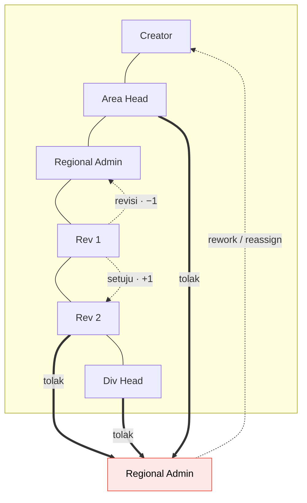
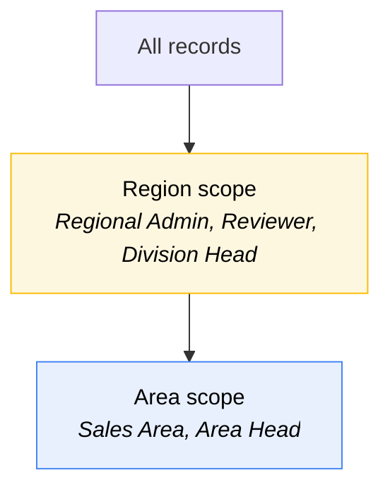
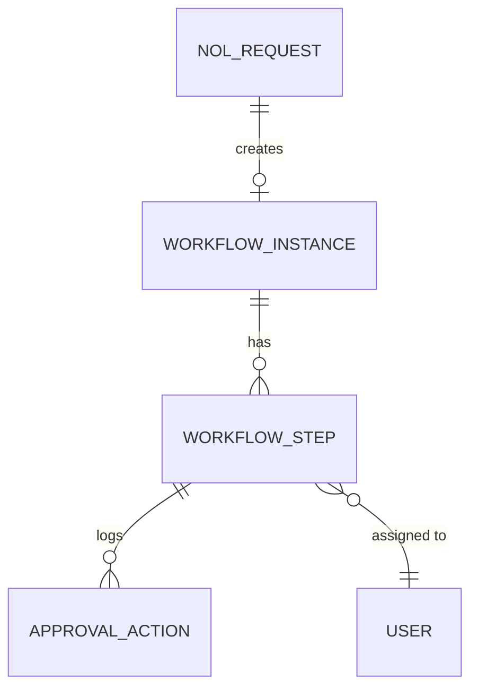

# Design — Approval Workflow

> **Canonical.** This document owns the approval chain, its three transitions and
> notification behaviour. Other documents summarise briefly and link here; if they
> disagree with this file, this file is right.

This is the part the client cares about most, because it is where cases get stuck
and where status becomes invisible.

## The chain

The client's stated baseline was
`Sales Area → Area Head → Region Sales → Reviewer`, adjusted against the official
procedure so that **Area Head sits before Regional Admin** and **the reviewers sit
after Regional Admin**:

```mermaid
flowchart LR
    C["Creator<br/><i>Sales Area</i>"] -->|SUBMIT| AH["Area Head"]
    AH -->|setuju| RA["Regional Admin<br/><i>SOR</i>"]
    RA -->|setuju| R1["Reviewer 1"]
    R1 -->|setuju| R2["Reviewer 2"]
    R2 -->|setuju| R3["Reviewer 3<br/><i>optional</i>"]
    R3 -->|setuju| DH["Division Head"]
    DH -->|setuju| OUT["NOL / RL issued"]

    style C fill:#e8f0fe,stroke:#4285f4,color:#000
    style AH fill:#e8f0fe,stroke:#4285f4,color:#000
    style RA fill:#fef7e0,stroke:#fbbc04,color:#000
    style OUT fill:#e6f4ea,stroke:#34a853,color:#000
```

This ordering resolves what looked like a contradiction in the sources, and it is
worth spelling out because it makes the rest coherent:

- **Regional Admin chooses the reviewers** (_"Bisa dipilih reviewernya siapa saja
  bisa 2-3 reviewer"_). With reviewers downstream of Regional Admin, the person
  who picks them acts before they do. Under the previous reading — reviewers
  first — Regional Admin would have been configuring a chain that had already run.
- The official _Diagram Alir 6.1_ hands off from the **Area** lane to the **SOR**
  lane at step 3a, and all analysis (3b.i–iii) happens in the SOR lane. Area Head
  closes the Area leg; everything after is SOR.
- The notulen's _"lalu reviewer hingga ke approval division head"_ — reviewers
  then flow to Division Head — is satisfied exactly.

### Area Head's endpoint

_"Area head hanya sampe lampiran 17 resume evaluasi"_ is a
**workflow endpoint**, not merely a visibility ceiling. The Area Head acts once,
approving the Area's work up to and including **Lampiran 17 (Evaluasi Registrasi
Berlangganan Gas)**, and takes no further action in the workflow.

This aligns with the official flow: _Diagram Alir 6.1_ step **2b — Evaluasi
Registrasi Berlangganan Gas — sits in the Area swimlane**, and Lampiran 17 is
precisely that document. The **Resume Evaluasi** that follows is prepared by
_Fungsi Sales & Customer Management Regional_, not by the Area.

So the document handover is:

| Document                        | Produced by           | Approved by              |
| ------------------------------- | --------------------- | ------------------------ |
| KK0 (Lampiran 10)               | Sales Area            | —                        |
| A1 / Registrasi (Lampiran 11)   | Sales Area + customer | —                        |
| **Evaluasi (Lampiran 17)**      | Sales Area            | **Area Head ← endpoint** |
| Permohonan NOL (Lampiran 15)    | Area → SOR            | Regional Admin           |
| **Resume Evaluasi**             | **Regional Admin**    | Reviewers                |
| Penerbitan NOL/RL (Lampiran 16) | SOR                   | **Division Head**        |

Area Head retains **read** visibility of their Area's records after this point
(they still need to know outcomes), but has no actionable step. Enforce the
distinction: visible ≠ actionable.

### Reviewer configuration

2 or 3 reviewers, chosen by Regional Admin. The docx's named instance
(_PIC Area Support_ → _PIC Leader Area Support_) is one concrete configuration,
not the schema — despite the "Area" in those titles, they occupy the reviewer
slots that now sit in the SOR leg.

---

## The three transitions

Verbatim from the notulen:

> 1. Setuju naik 1 tingkat
> 2. Tolak langsung balek ke admin regional
> 3. Revisi turun 1 tingkat

| Action     | Movement | Lands on                                           |
| ---------- | -------- | -------------------------------------------------- |
| **Setuju** | +1       | next step in the chain                             |
| **Revisi** | −1       | previous step (from Area Head → back to Creator)   |
| **Tolak**  | jump     | **Regional Admin**, regardless of current position |

**Tolak is not "back to sender".** It escalates sideways to Regional Admin, who
decides whether to rework, reassign, or kill the case. This is deliberate — it
stops a rejected case bouncing silently back into a sales rep's inbox and
disappearing. Implement it exactly as specified.

Note the edge case: when **Regional Admin themselves** rejects, the case is
already at Regional Admin. Treat that as "returned to Regional Admin's own
queue with a rejection reason" rather than a no-op, so the rejection is still
recorded and the case leaves the reviewers' queues.

### Comments are mandatory

A comment is **required** on both `Revisi` and `Tolak`.
Enforce server-side, not just in the form. A reviewer chain without recorded
reasons defeats the entire visibility goal.

---

## Status state machine

```mermaid
stateDiagram-v2
    direction TB
    [*] --> DRAFT

    DRAFT --> AREA_HEAD : submit (Sales)
    AREA_HEAD --> DRAFT : revisi
    AREA_HEAD --> REGIONAL_ADMIN : setuju

    REGIONAL_ADMIN --> AREA_HEAD : revisi
    REGIONAL_ADMIN --> IN_REVIEW : setuju

    state IN_REVIEW {
        direction LR
        R1 : Reviewer 1
        R2 : Reviewer 2
        R3 : Reviewer 3 (optional)
        R1 --> R2 : setuju
        R2 --> R1 : revisi
        R2 --> R3 : setuju
        R3 --> R2 : revisi
    }

    IN_REVIEW --> REGIONAL_ADMIN : revisi at Reviewer 1
    IN_REVIEW --> APPROVAL : setuju at last reviewer
    APPROVAL --> IN_REVIEW : revisi

    APPROVAL --> ISSUED_NOL : setuju
    APPROVAL --> ISSUED_RL : tidak layak

    AREA_HEAD --> REJECTED : tolak
    IN_REVIEW --> REJECTED : tolak
    APPROVAL --> REJECTED : tolak
    REJECTED --> DRAFT : Regional Admin reworks / reassigns

    ISSUED_NOL --> [*]
    ISSUED_RL --> [*]
```

`REJECTED` is held in Regional Admin's queue. It is a working state, not terminal
— only `ISSUED_NOL` and `ISSUED_RL` are terminal.

### Action vocabulary

| Action   | Who          | Effect                                                     |
| -------- | ------------ | ---------------------------------------------------------- |
| `SAVE`   | Creator      | Persist as draft; no state change                          |
| `SUBMIT` | Creator      | `DRAFT → AREA_HEAD`, chain snapshotted, Area Head notified |
| `SETUJU` | any approver | Advance one level                                          |
| `REVISI` | any approver | Step back one level; **comment required**                  |
| `TOLAK`  | any approver | Jump to Regional Admin; **comment required**               |

---

## Ownership handover

Editing rights move as the record advances. This is a genuine transfer, not just
a permission tweak:

| Stage / state                        | Who can edit                                                                                                                                      |
| ------------------------------------ | ------------------------------------------------------------------------------------------------------------------------------------------------- |
| 1–6, `DRAFT`                         | Sales Area                                                                                                                                        |
| `AREA_HEAD`, `IN_REVIEW`, `APPROVAL` | **Nobody.** Read-only; changes only via `Revisi` returning it down the chain (Q9)                                                                 |
| Stage 7 (`REGIONAL_ADMIN`)           | **Regional Admin** — _"bagian regional melengkapi data yang sudah diinput dari area"_ and _"data analisis kelayakan posisinya di regional admin"_ |
| Stage 8 (`APPROVAL`)                 | Nobody. Division Head approves/rejects only                                                                                                       |

Regional Admin is the only actor in the chain who both **edits** and **approves**
— they complete the Area's data and produce the feasibility analysis before
routing to reviewers.

---

## Notification & access

> ⚠️ **Email is deferred.** All notification below is **in-app only** for now.
> The email design is retained because it is built behind
> `INotificationChannel` and switched off, not removed.

The docx specifies email with link-based access:

> Review 1 : PIC Area Support (**by email link**)
> Review 2 : PIC Leader Area Support (**by email link**)
> Approval : Area Head …. (**by email**)

**When email arrives: authenticated deep links.** The message carries a link
to the record's review screen; it lands on the login page and redirects post-auth.
No bypass tokens, no one-click approval from the inbox — a NOL is a commercially
binding document.

**Until then, the in-app surfaces carry all of it:** the `Tugas Saya` badge, the
bell panel, `/tasks`, and the ageing report. Nothing pushes; a user who does not
open the app learns nothing. That makes the badge — including in the browser tab
title — load-bearing rather than decorative.

Notify on:

| Event                | Recipient                            |
| -------------------- | ------------------------------------ |
| Submitted            | Area Head                            |
| Setuju               | next step actor                      |
| Revisi               | previous step actor + creator        |
| Tolak                | Regional Admin + creator             |
| Reviewers assigned   | each reviewer                        |
| NOL/RL issued        | creator + Area Head + Regional Admin |

With email deferred, `/tasks` itself is what answers "nobody knows where it
is" — which is why that screen sorts by wait time descending.

---

## Visibility (RBAC)

> _area head regional bisa melihat 1 region itu tapi sales area spesifik hanya
> bisa melihat area tersebut_

Row-level, hierarchical. Sales Area users see **all records in their Area**,
not only their own.

| Role           | Scope                             | Can act                                    |
| -------------- | --------------------------------- | ------------------------------------------ |
| Sales Area     | Own **Area**                      | Create/edit stages 1–6, submit             |
| Area Head      | Own Area                          | Approve at `AREA_HEAD` step only           |
| Regional Admin | Own **Region** (all Areas within) | Edit stage 7, configure reviewers, approve |
| Reviewer       | Own Region                        | Approve at their reviewer step             |
| Division Head  | Own Region                        | Final approval                             |
| Admin          | All                               | Master data only                           |

Implemented as EF Core global query filters — see
[architecture.md](../build/architecture.md#row-level-security).
Never as per-screen filtering; that is how leaks happen.

**Visible ≠ actionable.** Area Head can see their Area's records at every stage
but can only act at their one step. Model the two permissions separately.

---

## Workflow configuration

There is no admin-configurable "workflow template" — the notulen only says
*"[Regional Admin] bisa dipilih reviewernya siapa saja bisa 2-3 reviewer"*,
which is a **per-case** action, not a schedule set up in advance:

- **Area Head and Division Head** are not configured here at all — they're
  whichever user holds that role for the record's Area/Region, resolved from
  `/master/users` at the moment the step is reached. No separate row needed.
- **Reviewer 1, 2, 3** are chosen by Regional Admin **per case**, via the
  `Tetapkan Reviewer` action on the record itself, when the case reaches them
  ([frontend/07 § Assigning reviewers](frontend/07-evaluation-and-issuance.md#assigning-reviewers)).
  That screen also decides 2 vs 3 reviewers for that case.

`workflow_instance`/`workflow_step` are ordinary case data, populated as the
case moves — not a projection of a master-data template, because there isn't
one.

---

## Audit trail

Every action appends an immutable row:

| Column                      |                                            |
| --------------------------- | ------------------------------------------ |
| `record_id`                 |                                            |
| `workflow_step_id`          |                                            |
| `actor_id`                  | who                                        |
| `action`                    | `SUBMIT` · `SETUJU` · `REVISI` · `TOLAK`   |
| `comment`                   | **required** on `REVISI` and `TOLAK`       |
| `from_status` / `to_status` |                                            |
| `acted_at`                  |                                            |

Append-only, enforced by a database trigger rejecting `UPDATE` and `DELETE`.

This log is the data behind the timeline in
[02-process-flow.md](../domain/02-process-flow.md#the-status-timeline) and the ageing
metrics in [reporting.md](reporting.md). It is the
answer to the client's problem statement — treat it as a core feature, not as
logging.
