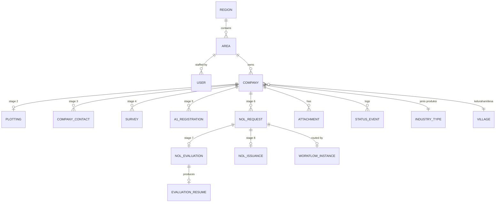
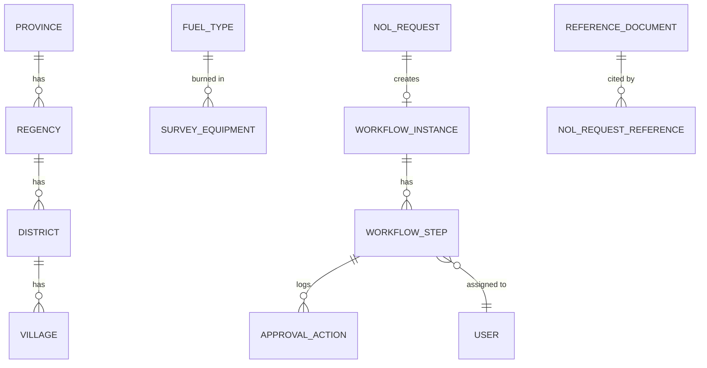

# Design — Data Model

> **Canonical.** This document owns entity and field definitions. Field tables in
> the domain docs describe _what the business means_; this one defines _what gets
> stored_.

## Core principle

**One record per prospective customer, spanning all 8 stages.** Stage-specific
data lives in satellite tables hanging off that record. Repeating groups are
child tables, never JSON blobs or numbered columns (`bahan_baku_1`,
`bahan_baku_2`, …) — the sources are full of "add row" instructions.

Requested terms and approved terms are separate rows, because
[Lampiran 16 can approve different terms than were requested](../domain/06-nol.md#stage-8--persetujuan-nol).

## ERD — core

## ERD — reference & workflow

---

## Entities

### `company` — the spine

The stage-1 record; everything hangs off it.

| Column                                   | Type                    | Source                                                                                                                                 |
| ---------------------------------------- | ----------------------- | -------------------------------------------------------------------------------------------------------------------------------------- |
| `id`                                     | uuid                    |                                                                                                                                        |
| `nomor_seq`                              | integer, unique         | Value from the **global** `company_nomor_seq` sequence — the real identity ([03](../domain/03-directory-plotting.md#the-nomor-format)) |
| `nomor`                                  | varchar, unique         | `Entry Apps!D5` — rendered `{seq}-{bps_prov}-{bps_kota_kab}`; re-rendered while `DRAFT`, frozen after                                  |
| `nama_perusahaan`                        | varchar                 | `D7`; also covers Lampiran 11 `Nama Perusahaan /Grup` — treated as the same field, not a separate group name |
| `website`                                | varchar, null           | `D9`                                                                                                                                   |
| `village_id`                             | fk → `village`          | `F14` (province / kota-kabupaten / kecamatan derive from it)                                                                           |
| `alamat`                                 | text                    | `F15`                                                                                                                                  |
| `location`                               | `geography(Point,4326)` | Manual pin-drop; Lampiran 10 §4 `Titik Koordinat`. PostGIS type, not two decimals — the map does radius and bbox queries               |
| `industry_type_id`                       | fk → `industry_type`    | `D17`                                                                                                                                  |
| `npwp`                                   | varchar, null           | Lampiran 11                                                                                                                            |
| `email`, `kode_pos`, `telp`, `fax`       | varchar, null           | Lampiran 11                                                                                                                            |
| `area_id`                                | fk → `area`             | drives visibility & workflow                                                                                                           |
| `current_stage`                          | smallint 1–8            |                                                                                                                                        |
| `status`                                 | enum                    | see [02](../domain/02-process-flow.md#status-vocabulary)                                                                               |
| `created_by`, `created_at`, `updated_at` |                         |                                                                                                                                        |
| `deleted_at`                             | soft delete             |                                                                                                                                        |

**Index** on `(area_id, current_stage, status)` — every list screen filters on
those three. **GiST index** on `location` for the map.

`nomor_seq` comes from a plain PostgreSQL `SEQUENCE` — atomic, lock-free, no
counter table. See
[03](../domain/03-directory-plotting.md#allocating-the-number).

### `plotting` — stage 2

| Column             | Type                                              | Source                                                                |
| ------------------ | ------------------------------------------------- | --------------------------------------------------------------------- |
| `company_id`       | fk, unique                                        |                                                                       |
| `sales_user_id`    | fk → `user`                                       | `Entry Apps!D19` "Plotting By"                                        |
| `posisi_pelanggan` | enum `pengembangan` \| `jalur_existing`           | `D21`, `F21` **and** `Data Plotting!D5, J3` — one column serving both |
| `kawasan`          | enum `kawasan_industri` \| `non_kawasan_industri` | `D23`                                                                 |

**No separate `jalur_pipa` column.** The worksheet's `Jalur Pipa` on the Plotting
screen is the list-screen label for `Posisi Pelanggan`; both resolve to this one
enum.

### `company_contact` — stage 3, repeating

| Column                                                | Type                  | Source             |
| ----------------------------------------------------- | --------------------- | ------------------ |
| `company_id`                                          | fk                    |                    |
| `nama`                                                | varchar, **required** | `Entry Apps!F25` ✱ |
| `jabatan`                                             | varchar, **required** | `F26` ✱            |
| `email`, `no_hp`, `linkedin`, `instagram`, `facebook` | varchar, null         | `F27:F31`          |
| `is_primary`                                          | bool                  |                    |
| `sort_order`                                          | smallint              |                    |

### `survey` — stage 4 (KK0) header

| Column                                            | Type                                      | Source                     |
| ------------------------------------------------- | ----------------------------------------- | -------------------------- |
| `company_id`                                      | fk                                        |                            |
| `tanggal_survey`                                  | date                                      |                            |
| `surveyor_user_id`                                | fk                                        | KK0 signature block        |
| `jumlah_karyawan`                                 | int                                       | `Entry Apps!D60`           |
| `jumlah_shift`                                    | smallint (1–3)                            | `K60`                      |
| `jam_kerja_per_hari`                              | decimal                                   | `D62`                      |
| `hari_per_minggu`                                 | smallint                                  | `K62`                      |
| `kebutuhan_energi`                                | set: `listrik,steam,panas,dingin,lainnya` | `F64:M64`                  |
| `kebutuhan_energi_lainnya`                        | varchar                                   | `M66`                      |
| `kapasitas_nilai`, `kapasitas_unit`               | decimal, enum `MW,Ton/Jam,Kkal,TR`        | `E65`, `F66:K66`           |
| `pemakaian_nilai`, `pemakaian_unit`               | decimal, enum `Kwh,Ton,Kkal,TR`           | `E67`, `F68:K68`           |
| `pipa_terdekat_jarak_m`                           | decimal, **required**                     | `F80` ✱                    |
| `pipa_terdekat_diameter`, `pipa_terdekat_tekanan` | decimal                                   | `H80`, `J80`               |
| `bahan_bakar_eksisting`                           | set                                       | KK0 §12 / Lampiran 10 §11  |
| `nama_pemasok`                                    | varchar                                   | KK0 §12                    |
| `kapasitas_listrik_kw`, `pemakaian_listrik_kwh`   | decimal                                   | KK0 §13                    |
| `rencana_pemanfaatan_gas`                         | set                                       | KK0 §14                    |
| `deskripsi_proses_produksi`                       | text                                      | KK0 §15                    |
| `beban_puncak`                                    | jsonb or child table                      | KK0 §10 — 2 windows        |
| `min_efisiensi_diharapkan_pct`                    | decimal                                   | Lampiran 10 §12            |
| `willingness_to_pay_usd_mmbtu`                    | decimal                                   | Lampiran 10 surveyor block |
| `keterangan_lain`                                 | text                                      | Lampiran 10                |
| `jumlah_kebutuhan_energi`                         | decimal, **derived**                      | Σ of equipment conversions |

**Children of `survey`:**

| Table                 | Columns                                                                                                                                                                            | Source                       |
| --------------------- | ---------------------------------------------------------------------------------------------------------------------------------------------------------------------------------- | ---------------------------- |
| `survey_product`      | `produk` ✱, `kapasitas`, `satuan` (`Kaps/Tahun`), `harga_produk`, `catatan`                                                                                                        | `Entry Apps!F42:J45`; KK0 §4 |
| `survey_raw_material` | `bahan`, `asal` (`impor`\|`lokal`), `country_id`, `volume`, `satuan` (`%`\|`Ton`\|`KL`\|`m2`), `periode` (`per_bulan`)                                                             | `F48:M51`                    |
| `survey_market`       | same shape; `country_id` = destination                                                                                                                                             | `F54:M57`                    |
| `survey_equipment`    | `jenis_peralatan`, `kapasitas`, `kapasitas_unit`, `jam_per_hari`, `hari_per_minggu`, `fuel_type_id`, `harga_bahan_bakar`, `konsumsi_per_bulan`, `konsumsi_unit`, `konversi_ke_gas` | `D70:M74`; KK0 §17           |

`konversi_ke_gas` is a plain manually-entered field, not derived — see
[04](../domain/04-prospect-survey.md#the-conversion-engine). `fuel_type_id`
and `konsumsi_per_bulan` stay on the row as descriptive record-keeping; no
`conversion_factor_id` is stored since no factor is applied automatically in
v1.

**No `survey_equipment_hourly` table.** Lampiran 17 §8's 24-hour load
profile is captured as a document upload (`spreadsheet_peralatan_gas`), not
a keyed 20×24 grid — see
[06-nol §8](../domain/06-nol.md#stage-6--permohonan-nol). Nothing downstream
reads a stored `Laju Alir` figure, so there is no derived value to persist.

### `a1_registration` — stage 5

| Column                                        | Type                                                                      | Source                                                                                 |
| --------------------------------------------- | ------------------------------------------------------------------------- | -------------------------------------------------------------------------------------- |
| `company_id`                                  | fk                                                                        |                                                                                        |
| `tanggal_registrasi`                          | date                                                                      | `Entry Apps!F83`                                                                       |
| `registrasi_source`                           | enum `online` \| `manual`                                                 | comment on `H83`; fixed to `manual` in v1                                              |
| `nama_penanggung_jawab`, `jabatan`            | varchar                                                                   | `D85`, `J85`                                                                           |
| `bulan_dimulai`                               | date                                                                      | `D91`                                                                                  |
| `basis_kontrak`                               | enum `harian`\|`bulanan`\|`tahunan`                                       | `F93:J93`                                                                              |
| `skema_harga`                                 | enum `reguler`\|`sigas`\|`bersyarat`                                      | `F94:J94`                                                                              |
| `segment_id`                                  | fk → `segment`                                                            | `K93`                                                                                  |
| `kode_harga`                                  | varchar                                                                   | `K94`                                                                                  |
| `harga_nilai`, `harga_currency`, `harga_unit` | decimal, enum `USD`\|`IDR`, enum `MMBtu`\|`m3`                            | Lampiran 17 — typed directly, no lookup                                                |
| `capex_awal`                                  | decimal                                                                   | `D98`                                                                                  |
| `mom_sigas_tersedia`                          | bool                                                                      | `F100`                                                                                 |
| `status_bangunan`                             | enum `dalam_rencana`\|`dalam_pembangunan`\|`eksisting`\|`proses_ekspansi` | Lampiran 11                                                                            |
| `sektor`                                      | enum `komersial`\|`industri`\|`transportasi` + `produksi_utama`           | Lampiran 11                                                                            |
| `jenis_peralatan_gas`                         | set (9 options + free text)                                               | Lampiran 11                                                                            |
| `tekanan_operasi_barg`                        | decimal                                                                   | Lampiran 11                                                                            |
| `signed_document_id`                          | fk → `attachment`                                                         | the signed file as re-uploaded                                                         |
| `signature_method`                            | enum `wet` \| `digital`, nullable                                         | **Self-declared by the uploader, never verified** — signing happens outside the system |

`a1_usage_period` (repeating): `periode_mulai`, `periode_selesai`, `rata_rata`,
`minimum`, `maksimum`, `sort_order`.

### `nol_request` — stage 6

| Column                                                                                                    | Type                                                                               | Source            |
| --------------------------------------------------------------------------------------------------------- | ---------------------------------------------------------------------------------- | ----------------- |
| `company_id`                                                                                              | fk                                                                                 |                   |
| `nomor_nota_dinas`                                                                                        | varchar                                                                            | Lampiran 15       |
| `registration_type`                                                                                       | enum `registrasi_baru` \| `amendemen` \| `perpanjangan`, default `registrasi_baru` |                   |
| `sama_dengan_a1`                                                                                          | bool                                                                               | `Entry Apps!D103` |
| `bulan_dimulai`                                                                                           | date                                                                               | `D106`            |
| `basis_kontrak`, `skema_harga`, `segment_id`, `kode_harga`, `harga_nilai`, `harga_currency`, `harga_unit` | as A1, typed directly                                                              | `F108:H111`       |
| `alasan_kontrak_bersyarat`                                                                                | text                                                                               | Lampiran 15       |
| `nama_pimpinan_perusahaan`                                                                                | varchar                                                                            | Lampiran 15       |
| `jangka_waktu_kontrak`                                                                                    | varchar                                                                            | Lampiran 15       |
| `capex_pre_gr3`                                                                                           | decimal                                                                            | `D113`            |
| `biaya_penyambungan_reguler`                                                                              | decimal                                                                            | `F115`            |
| `biaya_penyambungan_extra`                                                                                | decimal                                                                            | `F116`            |
| `biaya_penyambungan_jumlah`                                                                               | decimal, **derived**                                                               | `F117`            |
| `workflow_instance_id`                                                                                    | fk                                                                                 |                   |
| `submitted_at`                                                                                            | timestamptz                                                                        |                   |

Children: `nol_request_period` (periode, rata_rata, kontrak_minimum,
kontrak_maksimum), `nol_request_daily` (7 weekday rows: `hari`, `min`, `max` —
only when `basis_kontrak = harian`, see
[docs/future](../future/README.md#daily-contract-basis-harian)),
`nol_request_reference` (→ `reference_document`).

### `nol_evaluation` — stage 7

| Column                                                                    | Type                                             | Source             |
| ------------------------------------------------------------------------- | ------------------------------------------------ | ------------------ |
| `nol_request_id`                                                          | fk, unique                                       |                    |
| `feed_status`                                                             | enum `belum` \| `dalam_proses` \| `selesai`      | Diagram Alir 3b.i  |
| `feed_completed_at`                                                       | date, null                                       |                    |
| `capex_final`                                                             | decimal                                          | `Entry Apps!D119`  |
| `pipa_induk_panjang_m`, `pipa_induk_diameter`, `pipa_induk_diameter_unit` | decimal, enum `inch`\|`mm`                       | `D120`, `I120`     |
| `pipa_service_panjang_m`, `pipa_service_diameter`, `..._unit`             |                                                  | `D121`, `I121`     |
| `spesifikasi_mrs`                                                         | text                                             | `D122`             |
| `g_size`                                                                  | varchar                                          | `F124`             |
| `tekanan`, `maks_flowrate`                                                | decimal                                          | `G124`, `H124`     |
| `maks_kapasitas_meter_m3_jam`                                             | decimal                                          | Resume Evaluasi §4 |
| `durasi_pelaksanaan_bulan`                                                | smallint                                         | Resume Evaluasi §4 |
| `status_rkap`                                                             | enum `rkap` \| `non_rkap`                        | Resume Evaluasi §1 |
| `skema_pembayaran`                                                        | enum `jaminan_pembayaran` \| `pembayaran_dimuka` | Lampiran 17 §4     |
| `jaminan_*`                                                               | status/jenis/masa_berlaku/penerbit               | Lampiran 17 §4     |
| `ketersediaan_pasokan_bbtud`                                              | decimal, **manual entry**                        | Resume Evaluasi §5 |
| `analisis_komersial`, `analisis_kompetitor`, `kesimpulan`                 | text                                             | Lampiran 17 §5–6   |
| `radius_kompetitor_km`                                                    | decimal                                          | Lampiran 17 §6     |
| `evaluated_by`, `evaluated_at`                                            |                                                  | Regional Admin     |

`nol_evaluation_scenario` (2 rows — the two price columns on the Resume):
`label` (Harga …), `irr_pct`, `npv`, `payback_years`, `hasil_analisis`.

Modelling feasibility as **scenarios** rather than three flat columns is what
lets the Resume Evaluasi print its side-by-side comparison. The v1 UI renders
one scenario, so adding the second is a UI change, not a migration — see
[docs/future](../future/README.md#two-scenario-feasibility-comparison).

### `nol_issuance` — stage 8

| Column                            | Type                                           | Source              |
| --------------------------------- | ---------------------------------------------- | ------------------- |
| `nol_request_id`                  | fk, unique                                     |                     |
| `outcome`                         | enum `nol` \| `rl`                             | Lampiran 16         |
| `nomor_nota_dinas`                | varchar                                        |                     |
| `approved_terms`                  | child rows, same shape as `nol_request_period` | _Isi Persetujuan_   |
| `kontrak_bersyarat`               | text[]                                         | numbered conditions |
| `berlaku_sejak`, `berlaku_sampai` | date                                           |                     |
| `signed_by_user_id`, `signed_at`  |                                                | Direktur / GM SOR   |
| `document_id`                     | fk → `attachment`                              | generated `.docx`   |

### `attachment`

Polymorphic, one table for all nine-plus upload points.

| Column                                            | Type                                                                                                                                                                                                                                                                         |
| ------------------------------------------------- | ---------------------------------------------------------------------------------------------------------------------------------------------------------------------------------------------------------------------------------------------------------------------------- |
| `id`                                              | uuid                                                                                                                                                                                                                                                                         |
| `attachable_type`, `attachable_id`                | polymorphic fk                                                                                                                                                                                                                                                               |
| `kind`                                            | enum: `kk0` · `a1` · `mom_sigas` · `capex_pre_gr3` · `bukti_kelayakan` · `spreadsheet_peralatan_gas` · `gambar_situasi_pabrik` · `gambar_pipa_eksisting` · `titik_taping` · `data_kompetitor` · `resume_kelayakan` · `gas_balance` · `npwp` · `reference_document` · `other` |
| `filename`, `mime_type`, `size_bytes`, `checksum` |                                                                                                                                                                                                                                                                              |
| `storage_provider`                                | enum `s3` \| `onedrive` — **which store wrote this blob**                                                                                                                                                                                                                    |
| `storage_key`                                     | S3 object key, or OneDrive Graph `itemId` — never a path                                                                                                                                                                                                                     |
| `uploaded_by`, `uploaded_at`                      |                                                                                                                                                                                                                                                                              |
| `version`                                         | int — re-uploads supersede, never overwrite; **each version is a separate blob**                                                                                                                                                                                             |

`storage_provider` is per row, not per deployment, so MinIO and OneDrive can serve
side by side while PGN migrates. `storage_key` holds whatever that provider needs
to find the blob again — the two are different kinds of identifier, and OneDrive's
is deliberately **not** the file path
([storage §2](../build/storage.md#identity-is-the-providers-not-the-path)).

### `status_event` — the visibility engine

Append-only. Drives the timeline and every ageing metric.

| Column                     | Type                                                                   |
| -------------------------- | ---------------------------------------------------------------------- |
| `company_id`               | fk                                                                     |
| `from_stage`, `to_stage`   | smallint                                                               |
| `from_status`, `to_status` | enum                                                                   |
| `actor_id`                 | fk                                                                     |
| `action`                   | `CREATE` · `SAVE` · `SUBMIT` · `SETUJU` · `REVISI` · `TOLAK` · `ISSUE` |
| `comment`                  | text — **NOT NULL for `REVISI` and `TOLAK`**                           |
| `occurred_at`              | timestamptz                                                            |

Never update or delete rows here — enforce with a trigger rejecting `UPDATE` and
`DELETE`, not just application discipline. Current status is a projection of this
log; if they ever disagree, the log is right.

---

## Master data

| Table                                        | Contents                                                                                                                                                                                                             | Source                              |
| -------------------------------------------- | -------------------------------------------------------------------------------------------------------------------------------------------------------------------------------------------------------------------- | ----------------------------------- |
| `region`, `area`                             | **SOR I–IV and Areas.** Scope boundaries for every permission and approval chain — must exist before any user assignment                                                                                             | PGN org chart                       |
| `province`, `regency`, `district`, `village` | Administrative hierarchy + BPS codes. `regency` covers **both Kota and Kabupaten** — see [master-data](../domain/master-data.md#terminology--regency-means-kabupaten) — and carries `type` enum(`kota`,`kabupaten`)  | `Entry Apps!F11:F14`                |
| `country`                                    | Bahan Baku / Orientasi Pasar                                                                                                                                                                                         | comments on `J48`–`J51`             |
| `industry_type`                              | BPS/KBLI if available, else the 20 curated rows; extensible                                                                                                                                                          | `Jenis Industri!B5:C24`             |
| `segment`                                    | Bronze 1–3, Silver, Gold, Platinum. Not priced — `harga` lives on `a1_registration`/`nol_request` directly, typed per record                                                                                         | `Tabel!A3:A8`                       |
| `fuel_type`                                  | Union of both source lists, incl. Cangkang and Kayu                                                                                                                                                                  | KK0 §12 + Lampiran 10 §11           |
| `unit_of_measure`, `unit_set_member`         | **One table for all eight unit sets**, with `dimension` and set membership                                                                                                                                           | 8 unit lists across the sources     |
| `meter_size`                                 | **G-Size + nominal/max flow + pressure rating**                                                                                                                                                                      | `Entry Apps!D124`                   |
| `mrs_spec`                                   | **Spesifikasi MRS catalogue**                                                                                                                                                                                        | `Entry Apps!D122`                   |
| `reference_document`                         | The 5 **policy** documents cited on a NOL request (_Ketentuan Harga Gas_ etc.) — versioned, admin-uploaded. Not the same thing as a document _template_ — see [master-data §9](../domain/master-data.md#9-documents) | docx "LAIN-LAIN"                    |
| `reason_category`                            | **Optional grouping for Revisi/Tolak reasons**                                                                                                                                                                       | proposed, [reporting](reporting.md) |

Full inventory, sources and seeding order in
[master-data.md](../domain/master-data.md#2-complete-inventory).

> **One thing deliberately absent: upload/auth values.** Upload limits, session
> timeout, password and lockout policy are deployment configuration, because
> the app is not the only layer enforcing them — there is no `system_constant`
> table left for them to join anyway; see below.

**Several tables that would look natural here don't exist**, on the same
"don't store what nothing reads" logic: no `exchange_rate` table (nothing
computes with it), no `equipment_type` / `gas_usage_type` tables (fixed lists
declared in the component, with the free-text `(sebutkan)` slot staying a
form field either way), no `notification_template` table (wording is a code
constant, the notifications themselves are unaffected), no `document_template`
table (the six Lampiran `.docx` files ship with the application instead of
through an admin upload nothing validates), no `document_numbering` table
either (the format strings are code constants; only the counter — `next_seq`
per Area/Region per year — is still a database row, because that part is
genuinely mutable state, not configuration), no `workflow_template` table
(Regional Admin picks 2–3 reviewers per case, not from a pre-configured
roster), and no `system_constant`, `allocation` or `gas_balance` tables (PGN
tracks realisasi/alokasi and gas balance themselves; `Ketersediaan Pasokan`
on the evaluation is a plain manual field instead).

---

## Notes

- **Effective-dated master data.** Prices and conversion factors change. Every
  computed value stores the id of the factor/price row it used, so a 2026 NOL
  still reprints with 2026 numbers.
- **Derived fields are stored, not computed on read.** `jumlah_kebutuhan_energi`,
  `biaya_penyambungan_jumlah` — all persisted, because they appear on signed
  documents and must never drift. (`konversi_ke_gas` is persisted too, but it's
  a direct entry, not derived.)
- **Soft delete everywhere**, hard block on deleting anything that has been
  submitted.
- **`company` is the aggregate root.** All row-level security keys off
  `company.area_id`, applied as an EF Core global query filter — see
  [architecture](../build/architecture.md#row-level-security).
- **Use `decimal`, never `double`.** Every monetary and volumetric field appears
  on a signed document.
