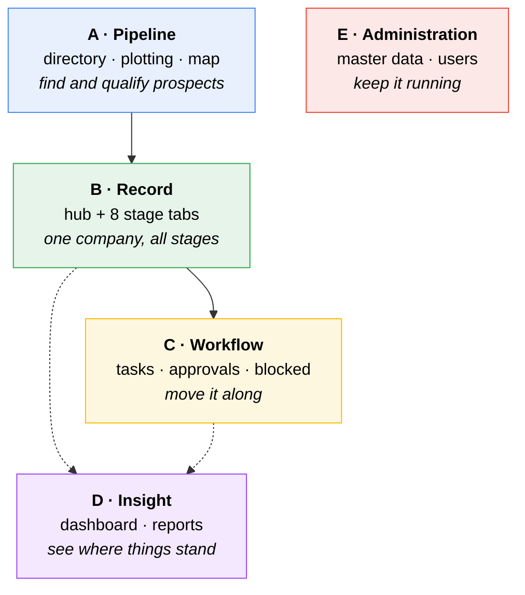
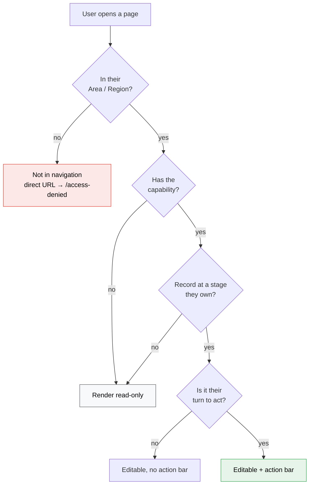

# Frontend 13 — Page × Role Matrix

Orientation map. Which pages exist, who reaches them, and — importantly — **which
pages render differently depending on who is looking**.

Read alongside [roles-permissions.md](../roles-permissions.md), which
defines the underlying model.

`SA` Sales Area · `AH` Area Head · `RA` Regional Admin · `RV` Reviewer ·
`DH` Division Head · `SYS` System Admin

✅ full access · 👁 read-only · ⏱ only when the record is at their step ·
🔀 **same page, different content** · 🔓 only under break-glass ·
❌ not in navigation

> **System Admin is a platform role, not a super user.** They own every screen in
> Group E and none in Groups A–D. Case data is reachable only through an audited,
> time-boxed break-glass
> ([design/roles-permissions §2.6](../roles-permissions.md#26-system-admin)).

---

## 1. Page groups

Five groups. Roles cluster naturally: **Sales Area lives in A and B**, the four
approver roles live in **C**, and **System Admin lives only in E** — never touching
case data.

---

## 2. The matrix

### Group A · Pipeline

| Route            | Page                 | SA  | AH  | RA  | RV  | DH  | SYS |
| ---------------- | -------------------- | :-: | :-: | :-: | :-: | :-: | :-: |
| `/directory`     | Directory list + map | ✅  | 👁  | ✅  | ❌  | ❌  | ❌  |
| `/directory/new` | Create company       | ✅  | ❌  | ✅  | ❌  | ❌  | ❌  |
| `/plotting`      | Plotting list + map  | ✅  | 👁  | ✅  | ❌  | ❌  | ❌  |
| `/map`           | Full-screen map      | 🔀  | 🔀  | 🔀  | 👁  | 👁  | ❌  |

### Group B · Record

| Route             | Page                 | SA  | AH  | RA  | RV  | DH  | SYS |
| ----------------- | -------------------- | :-: | :-: | :-: | :-: | :-: | :-: |
| `/companies/{id}` | Record hub — Summary | 🔀  | 🔀  | 🔀  | 🔀  | 🔀  | 🔓  |
| `…/plotting`      | Plotting tab         | ✅  | 👁  | ✅  | 👁  | 👁  | ❌  |
| `…/prospect`      | Contacts             | ✅  | 👁  | ✅  | 👁  | 👁  | ❌  |
| `…/survey`        | KK0 survey           | ✅  | 👁  | ✅  | 👁  | 👁  | ❌  |
| `…/a1`            | A1 registration      | ✅  | 👁  | ✅  | 👁  | 👁  | ❌  |
| `…/nol-request`   | NOL request          | ✅  | 👁  | ✅  | 👁  | 👁  | ❌  |
| `…/evaluation`    | Evaluation + Resume  | ❌  | 👁  | ✅  | 👁  | 👁  | ❌  |
| `…/nol-issuance`  | NOL/RL issuance      | ❌  | ❌  | 👁  | ❌  | ✅  | ❌  |
| `…/documents`     | Attachments          | ✅  | 👁  | ✅  | 👁  | 👁  | ❌  |

Editing rights are also **stage-dependent**, not just role-dependent: a Sales Area
user's ✅ on `…/survey` becomes 👁 the moment the record is submitted. See
[§4](#4-the-three-gates-in-the-ui).

### Group C · Workflow

| Route                | Page                                          | SA  | AH  | RA  | RV  | DH  | SYS |
| -------------------- | --------------------------------------------- | :-: | :-: | :-: | :-: | :-: | :-: |
| `/tasks`             | My tasks (inbox)                              | ❌  |  ⏱  |  ⏱  |  ⏱  |  ⏱  | ❌  |
| `/tasks/blocked`     | Stuck & rejected (own region)                 | ❌  | ❌  | ✅  | ❌  | ❌  | ❌  |
| `/admin/stuck-steps` | Stuck steps, **all regions**, minimal context | ❌  | ❌  | ❌  | ❌  | ❌  | ✅  |
| `/admin/break-glass` | Break-glass requests & log                    | ❌  | ❌  | 👁  | ❌  | 👁  | ✅  |
| `/tasks/history`     | My action history                             | ❌  | ✅  | ✅  | ✅  | ✅  | ❌  |

**Sales Area has no inbox** — they never hold an approval step. Records returned
by `Revisi` or `Tolak` surface on their dashboard instead
([02](02-dashboard.md#sales-area)).

**`/tasks/blocked` is Regional Admin only.** Every `Tolak` in the region lands
there, plus every orphaned step. If nobody watches that queue, cases die in it.

### Group D · Insight

| Route                          | Page                           | SA  | AH  | RA  | RV  | DH  | SYS |
| ------------------------------ | ------------------------------ | :-: | :-: | :-: | :-: | :-: | :-: |
| `/`                            | Dashboard                      | 🔀  | 🔀  | 🔀  | 🔀  | 🔀  | 🔀  |
| `/reports`                     | Reports hub                    | ✅  | ✅  | ✅  | ✅  | ✅  | ❌  |
| `/reports/funnel`              | Corong Penjualan               | ✅  | ✅  | ✅  | ✅  | ✅  | ❌  |
| `/reports/ageing`              | Penuaan                        | 🔀  | ✅  | ✅  | ✅  | ✅  | ❌  |
| `/reports/gas-demand`          | Potensi Kebutuhan              | ✅  | ✅  | ✅  | ✅  | ✅  | ❌  |
| `/reports/survey-productivity` | Produktivitas Survei           | 👁  | ✅  | ✅  | ❌  | ✅  | ❌  |
| `/reports/nol-outcomes`        | Hasil NOL / RL                 | 👁  | ✅  | ✅  | 👁  | ✅  | ❌  |

The dashboard is 🔀 for **every** role — it is the clearest case of one page with
six compositions.

### Authentication

| Route              | Page                | Who                                                            |
| ------------------ | ------------------- | -------------------------------------------------------------- |
| `/sign-in`         | Email + password    | everyone, unauthenticated                                      |
| `/change-password` | Change password     | everyone; **forced** on first sign-in and after an admin reset |
| `/access-denied`   | Out-of-scope notice | everyone                                                       |

No `/forgot-password` — self-service reset needs email, which is deferred.

### Group E · Administration

| Route                        | Page                                   | SA  | AH  | RA  | RV  | DH  | SYS |
| ---------------------------- | -------------------------------------- | :-: | :-: | :-: | :-: | :-: | :-: |
| `/master/organisation`        | SOR regions & Areas                    | ❌  | ❌  | 👁  | ❌  | ❌  | ✅  |
| `/master/countries`           | Negara                                 | ❌  | ❌  | ❌  | ❌  | ❌  | ✅  |
| `/master/industry-types`      | Jenis Industri                         | ❌  | ❌  | ❌  | ❌  | ❌  | ✅  |
| `/master/segments`            | Segmen                                 | ❌  | ❌  | 👁  | ❌  | 👁  | ✅  |
| `/master/fuel-types`          | Jenis bahan bakar                      | ❌  | ❌  | ❌  | ❌  | ❌  | ✅  |
| `/master/units`               | Satuan                                 | ❌  | ❌  | ❌  | ❌  | ❌  | ✅  |
| `/master/meter-sizes`         | G-Size                                 | ❌  | ❌  | 👁  | ❌  | ❌  | ✅  |
| `/master/mrs-specs`           | Spesifikasi MRS                        | ❌  | ❌  | 👁  | ❌  | ❌  | ✅  |
| `/master/reference-documents` | Dokumen acuan kerja                    | 👁  | 👁  | 👁  | 👁  | 👁  | ✅  |
| `/master/reason-categories`   | Kategori alasan                        | ❌  | ❌  | 👁  | ❌  | ❌  | ✅  |
| `/master/users`               | Pengguna — **akun, peran, kata sandi** | ❌  | ❌  | 🔀  | ❌  | ❌  | ✅  |

Full definitions of these entities in
[master-data.md](../../domain/master-data.md#2-complete-inventory).

Note the **read-only grants to Regional Admin** on segments, meter sizes and MRS
specs. They own the feasibility analysis, so they need to see the values
feeding their numbers — but they must not be able to change corporate master
data to make a deal work.

**No row is ❌ for every role.** Upload limits, session timeout and password policy
have no row here at all, because they have no page — they are deployment
configuration, reachable only by whoever runs the server. Where PGN
self-hosts and the vendor holds System Admin, that is a real separation
of duties rather than an omission.

`/master/reference-documents` is 👁 for everyone: the _Ketentuan_ documents govern
the decisions people are making, so they should be readable without an admin.

---

## 3. Pages that change by role (🔀)

Six pages render materially different content depending on who opens them. These
are the ones most likely to be built wrong — as separate pages per role, or as one page
with the wrong things hidden.

### `/` — Dashboard

| Role         | Composition                                                                         |
| ------------ | ----------------------------------------------------------------------------------- |
| SA           | Returned-work panel · my pipeline · in-approval list · mini map                     |
| AH · RV · DH | Pending-approval table (the page) · area summary · own turnaround · recent activity |
| RA           | Stuck tasks · pending · region funnel · ageing summary                              |
| SYS          | Master-data health only — no case data                                              |

Detail in [02-dashboard.md](02-dashboard.md).

### `/companies/{id}` — Record hub

Same page, four differences:

| Aspect            | Varies how                                                                                                                     |
| ----------------- | ------------------------------------------------------------------------------------------------------------------------------ |
| **Visible tabs**  | `…/evaluation` hidden from SA; `…/nol-issuance` hidden from everyone but RA (👁) and DH                                        |
| **Editable tabs** | By role **and** current stage — see [§4](#4-the-three-gates-in-the-ui)                                                         |
| **Action bar**    | `Simpan`/`Ajukan` for the creator in draft; `Setuju`/`Revisi`/`Tolak` for whoever holds the step; **absent** for everyone else |
| **Extra actions** | RA additionally gets `Tetapkan Reviewer`                                                                                       |

### `/map` — Full-screen map

Pin set is scoped: SA and AH see their Area; RA, RV and DH see the whole Region.
SA and RA can drop and move pins; everyone else views only.

### `/reports/ageing`

Sales Area sees ageing for their Area's records, same plain elapsed-time table
as everyone else — there is no separate per-user breakdown to restrict
([09-reports.md](09-reports.md#penuaan--the-key-report)).

### `/master/users`

| Role | Sees                   | May do                                                                                                           |
| ---- | ---------------------- | ---------------------------------------------------------------------------------------------------------------- |
| RA   | Own region's users     | Create accounts, assign **Sales Area / Area Head / Reviewer**, reset passwords, deactivate — **own region only** |
| SYS  | All users, all regions | All of the above, plus assign Regional Admin and Division Head                                                   |

Regional Admin cannot appoint Regional Admins or Division Heads, cannot create a
user outside their region, and nobody may edit their own assignments or reset
their own password.

Since there's no SSO, this page owns **account lifecycle**, not just roles —
creation, temporary passwords, deactivation.

### `/tasks`

Not marked 🔀 because the layout is identical — but the **content is entirely
personal**: only steps where it is genuinely this user's turn. Records they can see
but cannot act on live under a separate _Semua di Region_ tab.

---

## 4. The three gates in the UI

A cell in the matrix above is necessary but not sufficient. The UI resolves
**scope + capability + turn** ([roles-permissions §1](../roles-permissions.md#1-the-permission-model)),
and stage adds a fourth practical constraint on editing:

Worked example — the **Survey tab**, same page, five outcomes:

| Who            | Record state      | Result                                                |
| -------------- | ----------------- | ----------------------------------------------------- |
| SA, own Area   | `DRAFT`           | Editable, `Ajukan` available                          |
| SA, own Area   | at Area Head      | **Read-only** — locked on submit                      |
| SA, other Area | any               | Not in navigation; direct URL → `/access-denied`      |
| AH, own Area   | at Area Head      | Read-only + `Setuju`/`Revisi`/`Tolak`                 |
| RA             | at Regional Admin | Editable **and** action bar — the only role with both |

### Rendering rules

1. **Out of scope → hide.** Not greyed out; absent from navigation entirely.
2. **No capability → read-only**, rendered as text rather than disabled inputs. A
   page of grey boxes is harder to read than plain values.
3. **Not their turn → no action bar**, rather than a disabled one.
4. **Blocked by a gate → disabled with the reason stated.** _"Dokumen 'Bukti
   Kelayakan' belum diunggah"_ teaches; a silently dead button generates support
   calls.

All of this is **cosmetic**. Every endpoint re-checks server-side
([roles-permissions §6](../roles-permissions.md#6-enforcement-checklist)).

---

## 5. Entry points per role

Where each role actually starts, and the shortest path to their main job.

| Role               | Lands on                        | Main journey                                                                                     |
| ------------------ | ------------------------------- | ------------------------------------------------------------------------------------------------ |
| **Sales Area**     | Dashboard → returned-work panel | `/directory` → create → `/companies/{id}` → survey → A1 → NOL → submit                           |
| **Area Head**      | Dashboard → pending table       | `/tasks` → `[ Tinjau ]` → record hub → `Setuju`                                                  |
| **Regional Admin** | Dashboard → stuck tasks         | `/tasks` → evaluation tab → assign reviewers → `Setuju`; plus `/tasks/blocked`                   |
| **Reviewer**       | Dashboard → pending table       | `/tasks` → `[ Tinjau ]` → record hub → `Setuju`                                                  |
| **Division Head**  | Dashboard → pending table       | `/tasks` → issuance tab → `Terbitkan NOL`                                                        |
| **System Admin**   | `/admin/…` master-data health   | Seeding and maintenance only                                                                     |

Every approver's journey is **inbox → review → act**, which is why _Tugas Saya_
carries a badge and why the review screen is the record hub rather than a
standalone approval form
([08-tasks-and-approvals.md](08-tasks-and-approvals.md#review-screen)).

---

## 6. Build order by group

Groups map cleanly onto the delivery phases in
[architecture.md](../../build/architecture.md#delivery-order):

| Phase | Group             | Why here                                                                                                            |
| ----- | ----------------- | ------------------------------------------------------------------------------------------------------------------- |
| 0     | E (partial)       | Organisation, users, RBAC — everything depends on it                                                                |
| 1     | A                 | Visible value, low risk, exercises scoping                                                                          |
| 2     | D (partial)       | Status log, timeline, ageing — **the problem statement**, demonstrable on phase-1 data before the heavy forms exist |
| 3–4   | B                 | The heavy stage forms                                                                                               |
| 5     | C                 | Workflow engine and approvals                                                                                       |
| 6     | B (remainder)     | Evaluation and issuance                                                                                             |
| 7     | D + E (remainder) | Reports, exports, remaining master data                                                                             |

Group E splits deliberately: organisation and users are **phase 0** because nothing
runs without them, while pricing, conversion factors and document templates arrive
with the features that consume them.
