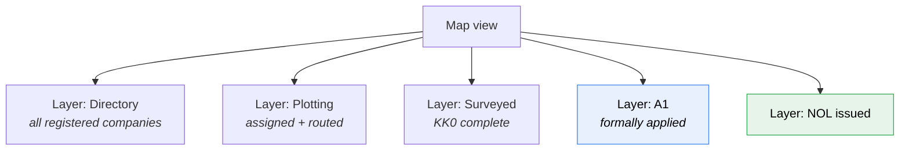
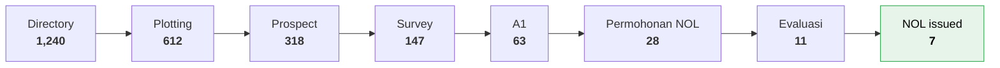

# Design — Dashboard, Map & Reporting

The client's problem statement is a reporting problem: *"tidak bisa memonitor
workflownya statusnya dah sampai mana"*. This document is therefore not a
nice-to-have appendix — it is the deliverable that closes the stated gap.

---

## The map

Requested three separate times in the meeting notes:

| Stage | Requirement |
|---|---|
| 1 Directory | *"database perusahaan besar, yang berminat mana saja tempatnya, **tampilkan di map**"* |
| 4 Survey | *"yang sudah pernah disurvey dimana lalu **tunjukkan di map**"* |
| 5 A1 | *"**ditunjukkan di map** yang sudah status ini"* |

So it is one map with **stage-based layers**, not three maps.

### Data source

`latitude` / `longitude` on `company`. The paper form already collects this —
Lampiran 10 §4 `Titik Koordinat: Longitude / Latitude`, and the client's `KK0` §2
has `Tagging` — but only at survey time, whereas the map was first requested at
Directory stage.

Coordinates are set by **dropping a pin on a map**, available from stage 1
onward. Not geocoded from the address, and not deferred to survey. So the
Directory and
Plotting screens each need a map mode alongside the table, and pin-drop is part of
the create/edit form rather than a separate step.

### Layers

**No pipeline-network layer.** PGN cannot supply the pipe geometry as
GeoJSON/shapefile, so the map shows company pins only. The pipe-situation
drawings stay as **document
uploads**, exactly as the paper process already handles them — Lampiran 17 §9–11
(*"Gambar Situasi Pipa Eksisting, Rencana Pipa Ke Lokasi Calon Pelanggan, dan
Potensi Sekitar Pabrik"*, *"Usulan Titik Taping dan Keandalan Jaringan"*).

`Jalur Pipa` and `Kawasan` remain useful as **pin filters** even without a network
layer.

### Pin encoding

- **Colour** → current stage (1–8), matching the stage colours used throughout
- **Size** → `Jumlah Kebutuhan Energi` (converted gas demand), so big prospects
  are visually obvious
- **Shape/badge** → `Posisi Pelanggan`: on an existing route vs needs development
- Click → record summary card → open record

### Filters

Same controls as the list screens (Provinsi → Kota/Kabupaten → Kecamatan →
Kelurahan/Desa, jenis produksi, posisi pelanggan, kawasan), plus stage and status.
All scoped by the user's area/region per
[approval-workflow](approval-workflow.md#visibility-rbac).

---

## Allocation & Gas Balance — not rebuilt in-system

`Data Plotting!C30:F33` is PGN's **own** live spreadsheet widget, with real
formulas (`=60/64*D30`, `=D31*1000*30`, `=F31/F32`) tracking monthly
realisasi vs alokasi BBTUD per Area. It exists in their worksheet, not as a
request to rebuild it here.

This platform is document/workflow management, not a capacity-planning tool.
Rebuilding PGN's own tracking — monthly data entry, a dashboard, computed
utilisation, the `60/64` conversion factor as an admin-editable constant — is
scope nobody asked this system to take on.

The one place this touches the workflow is Resume Evaluasi §5: *"masih
terdapat ketersedian Pasokan sebesar …… BBTUD"*. That's now a single manual
field on the Evaluation tab, typed in from whatever process Regional Admin
already uses — the same move as IRR/NPV/Payback and gas pricing before it.
See [frontend/07](frontend/07-evaluation-and-issuance.md#supply-analysis).

---

## Pipeline / status reporting

Not requested explicitly, but this is the direct answer to the problem statement.

### Funnel

*(illustrative numbers)*

Conversion rate between each pair, filterable by area, sales rep, industry type
and period.

### Ageing — the key report

Derived from `status_event`. For every record currently in the workflow:

| Record | Stage | Current actor | Waiting |
|---|---|---|---|
| PT Indah Kejora | Persetujuan NOL | Reviewer 2 (Dewi) | **11 days** |
| PT Big Note | Evaluasi NOL | Regional Admin | 4 days |
| PT Kota Baru | A1 | Sales Area (Budi) | 2 days |

Sorted by wait time descending. Plain elapsed time, nothing else — no per-step
threshold, no colour-coded breach status, no admin screen to configure one.
This single table is what makes the invisible visible, and it should be the
default landing screen for Area Head, Regional Admin and Division Head.

### Suggested standard reports

| Report | Audience |
|---|---|
| Funnel by area / sales rep / period | Area Head, Regional Admin |
| FEED status of cases awaiting evaluation | Regional Admin |
| Ageing (wait time per record) | everyone with an approval role |
| Converted gas demand pipeline (Σ `Jumlah Kebutuhan Energi` by stage) | Regional Admin — capacity planning |
| Survey productivity (KK0s completed per rep per month) | Area Head |
| NOL vs RL outcome rate, with rejection reasons | Division Head |
| Records rejected to Regional Admin, unresolved | Regional Admin |

All exportable to Excel — this organisation runs on spreadsheets and will want
the data back out.
