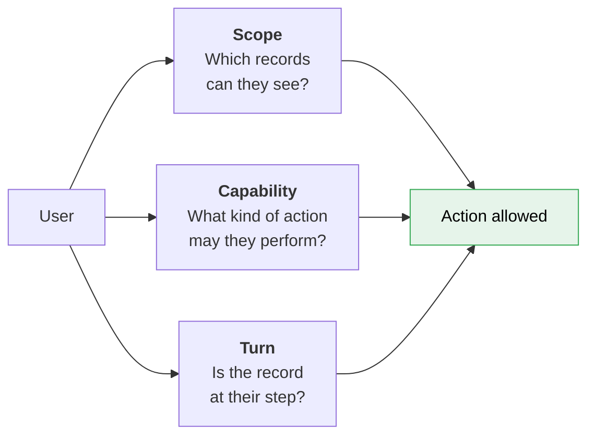
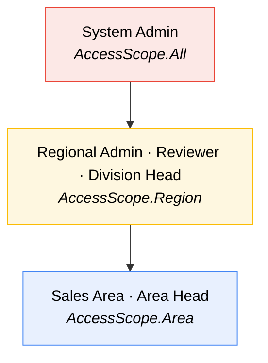
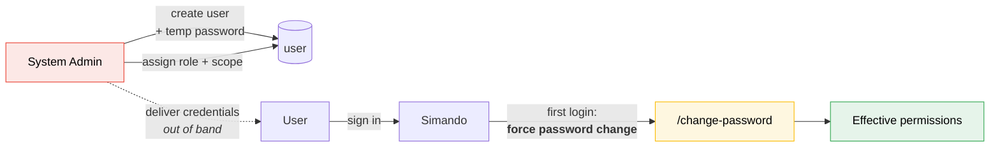

# Design — Roles, Permissions & User Management

> **Canonical.** This document owns the scope / capability / turn model and the
> capability matrix. The frontend
> [page × role matrix](frontend/13-page-role-matrix.md) applies it to screens; it
> does not redefine it.

Everything here derives from the approval chain in
[approval-workflow.md](approval-workflow.md) and the visibility rule in
`notulen.txt`. This document is the single reference for "who can do what".

---

## 1. The permission model

Three independent questions, deliberately kept separate. Most access bugs come
from conflating them.



An action is permitted only when **all three** hold.

| Question | Mechanism | Where enforced |
|---|---|---|
| **Scope** — which records | `AccessScope` = `Area` / `Region` / `All`, resolved from the user's assignment | EF Core global query filter ([architecture](../build/architecture.md#row-level-security)) |
| **Capability** — what kind of action | Role → capability grants | Policy handlers on every endpoint and component |
| **Turn** — is it their step | The record's current `workflow_step.assigned_user_id` | Workflow service, checked server-side |

### Why "turn" is separate from "capability"

An Area Head *has* the capability to approve. But they may only approve **a record
currently sitting at the Area Head step**. Without the third check, an Area Head
could approve a case that hasn't reached them yet, or one already with the
Division Head.

The same separation gives us the rule stated in
[approval-workflow](approval-workflow.md#visibility-rbac): **visible ≠ actionable.** An Area
Head can *see* their Area's records at every stage but can only *act* at one.

---

## 2. Role catalogue

Six roles. The first five are the approval chain in order; the sixth is
operational.

### 2.1 Sales Area

| | |
|---|---|
| **Scope** | Own **Area** — all records in it, not only their own |
| **Chain position** | Creator (step 0) |
| **Owns stages** | 1–6 |

The workhorse role. Creates directory entries, plots them, records contacts, runs
the KK0 survey, drafts the A1 and the NOL request, and submits for approval.

Can do:
- Create, edit and soft-delete companies in their Area
- Drop and move map pins
- Fill every stage 1–6 form
- Generate KK0 / A1 documents and upload the signed files after they are signed
  outside the system
- Submit a record into the approval chain
- Edit a record returned to them by `Revisi`
- View reports and the map, scoped to their Area

Cannot:
- Act on any approval step
- Edit a record once submitted (until it comes back via `Revisi`)
- Touch stage 7 evaluation fields
- See any other Area's records

### 2.2 Area Head

| | |
|---|---|
| **Scope** | Own **Area** |
| **Chain position** | Step 1 |
| **Endpoint** | **Lampiran 17** — *"Area head hanya sampe lampiran 17 resume evaluasi"* |

Approves the Area's work and hands the case to the Region. Their involvement in
the workflow **terminates** at that point.

Can do:
- `Setuju` / `Revisi` / `Tolak` on records **at the Area Head step**
- Read every record in their Area at every stage, including after handover
- View reports, ageing and the map for their Area

Cannot:
- Edit any record field, at any stage
- Act on a record past their step — even though they can still see it
- Choose reviewers for a case

> The read-after-handover permission is deliberate: an Area Head needs to know
> whether their Area's cases were approved. Grant read, withhold action.

### 2.3 Regional Admin (SOR)

| | |
|---|---|
| **Scope** | Own **Region** — every Area within it |
| **Chain position** | Step 2 |
| **Owns stage** | 7 |

The most powerful non-administrative role, and the only actor in the chain that
both **edits** and **approves**.

Can do:
- Everything Area Head can, across the whole Region
- **Edit stage 7**: final capex, pipe sizing, MRS spec, IRR / NPV / Payback
- Record the FEED checkpoint
- Produce the **Resume Evaluasi**
- Complete data the Area left incomplete — *"bagian regional melengkapi data yang sudah diinput dari area"*
- **Choose the 2–3 reviewers** for a case
- **Reassign a stuck workflow step** to a different user
- Own the `REJECTED` queue — every `Tolak` in the Region lands here

Cannot:
- Issue the NOL or RL
- Edit corporate master data (prices, conversion factors, regions)

### 2.4 Reviewer

| | |
|---|---|
| **Scope** | Own **Region** |
| **Chain position** | Steps 3–5 (2 or 3 reviewers, chosen per case) |

A **per-case assignment**, not a standing position. Regional Admin picks who fills
Reviewer 1, 2 and optionally 3. The docx names one instance — *PIC Area Support*
then *PIC Leader Area Support* — but any user granted the Reviewer capability can
be assigned.

Can do:
- `Setuju` / `Revisi` / `Tolak` on records **at their own reviewer step**
- Read the full record and every attachment
- Add comments

Cannot:
- Edit any field — records are read-only for everyone while under review
- Act on another reviewer's step, or skip ahead
- Reassign themselves

### 2.5 Division Head

| | |
|---|---|
| **Scope** | Own **Region** |
| **Chain position** | Final step |

On the official Nota Dinas this is *Direktur Komersial / General Manager, Sales
and Operation Region*.

Can do:
- `Setuju` → **issue the NOL**, or mark not-feasible → **issue the RL**
- Attach `Kontrak Bersyarat` conditions to an approval
- Set the approved terms, which may differ from those requested (Lampiran 16)
- Set the NOL validity period
- `Revisi` / `Tolak`
- Read everything in the Region; view all reports

Cannot:
- Edit stage 1–7 data fields

### 2.6 System Admin

| | |
|---|---|
| **Scope** | **All** — for platform data. **None** for case data |
| **Chain position** | none — never appears in an approval chain |

**Not an omnipotent super user.** This is a *platform* administrator: they own
configuration and accounts, and are deliberately kept out of commercial records.

Can do:
- **Master data** — regions & areas, geography, industry types, segments, fuel
  types, units, meter sizes, MRS specs, reference documents, reason categories
- **Accounts** — create users, assign any role in any region, reset passwords,
  deactivate
- **Workflow recovery** — reassign a stuck step, via a view that shows only company
  name, step and assignee (see below)

Cannot:
- **Approve, reject or revise anything.** No exception, no override, no
  break-glass. If a Division Head is unavailable the answer is to appoint another
  Division Head, not to let IT sign a NOL
- **Open a record or read case data** — surveys, pricing, evaluations,
  attachments — except under break-glass
- Edit any case field, ever
- **Change deployment configuration** — upload limits, session timeout, password
  and lockout policy live in `appsettings.json` and belong to whoever runs the
  server. Where PGN hosts it themselves and the vendor is System Admin, these are
  two different people, and that separation is worth keeping

#### Why the restriction

Three reasons, and they are not ceremonial:

1. **The data is commercially sensitive.** Survey records hold customer production
   volumes, fuel costs, `Willingness To Pay` and competitor analysis; NOL records
   hold negotiated pricing. That is not IT's to browse.
2. **The System Admin may be the vendor**, certainly during build and early
   operation. A supplier account with standing read access to an SOE's commercial
   pipeline is hard to justify.
3. **Segregation of duties.** Someone who can grant themselves any role *and* read
   every record *and* act in the chain has defeated the chain. Blocking the third
   is what keeps the first two safe.

PGN's own procedure works this way — the `Calon Pelanggan | Area | SOR | Fungsi
Lain` swimlanes exist precisely to separate functions.

#### Workflow recovery without case access

System Admin can reassign a stuck step, which needs *some* record context. Rather
than granting record access for it, there is a dedicated view exposing only what a
reassignment requires:

```
┌──────────────────────────────────────────────────────────────────────────────────┐
│  Langkah Tertahan — Semua Region                                                 │
├──────────────────┬────────────┬──────────────────┬──────────┬───────────────────┤
│ Perusahaan       │ Region     │ Langkah          │ Tertahan │                   │
├──────────────────┼────────────┼──────────────────┼──────────┼───────────────────┤
│ PT Mitra Abadi   │ SOR II     │ Reviewer 2       │ 9 hari   │ [ Tetapkan Ulang ]│
│ PT Larantuka     │ SOR III    │ Admin Regional   │ 14 hari  │ [ Tetapkan Ulang ]│
└──────────────────┴────────────┴──────────────────┴──────────┴───────────────────┘
   ℹ️ Hanya nama perusahaan, langkah, dan penerima. Data record tidak ditampilkan.
```

Company name is unavoidable — you cannot reassign a step without knowing which case
it belongs to — but no survey figure, price or document is reachable from here.

#### Break-glass

For genuine support incidents ("this user says the record won't load"), System
Admin can request **temporary read access to a single record**:

| Property | |
|---|---|
| Scope | **One record, read-only.** Never write, never approve |
| Duration | 60 minutes, then expires automatically |
| Requires | A written reason, recorded |
| Audit | `BREAK_GLASS` event on the record timeline — visible to Regional Admin and Division Head |
| Notification | In-app to the record's Regional Admin and Division Head |

The point is not to prevent access — an admin with database credentials can read
anything. The point is that doing it through the application **leaves a mark that
the business can see**. An admin who prefers not to leave a mark has to go around
the application, which is itself the signal.

#### Bootstrapping the first admin

A gap worth stating: with no directory to authenticate against, **the first System
Admin cannot be created by anyone**.

- Seed one account via a database migration or a one-off CLI command, with
  `must_change_password = true`
- Its credentials are set at deployment, never committed
- **Once a real System Admin exists, deactivate the seed account** — and make that
  a go-live checklist item, because seeded accounts are exactly what gets forgotten

---

## 3. Capability matrix

`SA` Sales Area · `AH` Area Head · `RA` Regional Admin · `RV` Reviewer ·
`DH` Division Head · `SYS` System Admin

✅ allowed · 👁 read-only · ⏱ only when the record is at their step ·
🔓 **only under break-glass** ([§2.6](#break-glass)) · ❌ denied

ᵃ System Admin reassigns through the
[stuck-steps view](#workflow-recovery-without-case-access), which shows company
name, step and assignee only — not the record.

### Records

| Capability | SA | AH | RA | RV | DH | SYS |
|---|:--:|:--:|:--:|:--:|:--:|:--:|
| View company records | ✅ | 👁 | ✅ | 👁 | 👁 | 🔓 |
| Create company (Directory) | ✅ | ❌ | ✅ | ❌ | ❌ | ❌ |
| Edit stages 1–3 | ✅ | ❌ | ✅ | ❌ | ❌ | ❌ |
| Soft-delete company (DRAFT only) | ✅ | ❌ | ✅ | ❌ | ❌ | ✅ |
| Drop / move map pin | ✅ | ❌ | ✅ | ❌ | ❌ | ❌ |
| Edit Survey / KK0 (stage 4) | ✅ | ❌ | ✅ | ❌ | ❌ | ❌ |
| Edit A1 (stage 5) | ✅ | ❌ | ✅ | ❌ | ❌ | ❌ |
| Sign / upload signed A1 | ✅ | ❌ | ✅ | ❌ | ❌ | ❌ |
| Edit NOL request (stage 6) | ✅ | ❌ | ✅ | ❌ | ❌ | ❌ |
| **Edit Evaluation (stage 7)** | ❌ | ❌ | ✅ | ❌ | ❌ | ❌ |
| **Produce Resume Evaluasi** | ❌ | ❌ | ✅ | ❌ | ❌ | ❌ |
| Record FEED checkpoint | ❌ | ❌ | ✅ | ❌ | ❌ | ❌ |
| Upload attachments | ✅ | ❌ | ✅ | ❌ | ❌ | ❌ |
| Download attachments | ✅ | ✅ | ✅ | ✅ | ✅ | ❌ |
| Generate documents (.docx) | ✅ | ✅ | ✅ | ✅ | ✅ | ❌ |

`RA` edits stages 1–6 only to complete what the Area left incomplete, and only
while the record is in their Region.

### Workflow

| Capability | SA | AH | RA | RV | DH | SYS |
|---|:--:|:--:|:--:|:--:|:--:|:--:|
| Submit for approval | ✅ | ❌ | ❌ | ❌ | ❌ | ❌ |
| `Setuju` | ❌ | ⏱ | ⏱ | ⏱ | ⏱ | ❌ |
| `Revisi` (comment required) | ❌ | ⏱ | ⏱ | ⏱ | ⏱ | ❌ |
| `Tolak` (comment required) | ❌ | ⏱ | ⏱ | ⏱ | ⏱ | ❌ |
| **Issue NOL / RL** | ❌ | ❌ | ❌ | ❌ | ✅ | ❌ |
| Set approved terms & `Kontrak Bersyarat` | ❌ | ❌ | ❌ | ❌ | ✅ | ❌ |
| Choose reviewers for a case | ❌ | ❌ | ✅ | ❌ | ❌ | ❌ |
| Reassign a workflow step | ❌ | ❌ | ✅ | ❌ | ❌ | ✅ᵃ |
| View the record timeline | ✅ | ✅ | ✅ | ✅ | ✅ | 🔓 |

### Reporting & administration

| Capability | SA | AH | RA | RV | DH | SYS |
|---|:--:|:--:|:--:|:--:|:--:|:--:|
| Dashboard & funnel | ✅ | ✅ | ✅ | ✅ | ✅ | ❌ |
| Ageing report | ✅ | ✅ | ✅ | ✅ | ✅ | ❌ |
| Export to Excel (non-PII) | ✅ | ✅ | ✅ | ✅ | ✅ | ❌ |
| **Export contact data (PII)** | ❌ | ❌ | ✅ | ❌ | ✅ | ❌ |
| Manage master data | ❌ | ❌ | ❌ | ❌ | ❌ | ✅ |
| **Break-glass record read** | ❌ | ❌ | ❌ | ❌ | ❌ | ✅ |
| Assign roles | ❌ | ❌ | ⚠️ | ❌ | ❌ | ✅ |

⚠️ Regional Admin may assign **Area-level** roles within their own Region only —
see [§5](#5-identity--user-management).

**PII export is restricted** because `company_contact` holds named individuals'
mobile numbers and social handles. Indonesia's PDP Law (UU 27/2022) applies
([architecture](../build/architecture.md#security)).

---

## 4. Scope resolution



Every record keys off `company.area_id`; `area` belongs to `region`.

```csharp
public enum AccessScope { Area, Region, All }

public interface ICurrentUser
{
    Guid        UserId    { get; }
    AccessScope Scope     { get; }
    Guid?       AreaId    { get; }
    Guid?       RegionId  { get; }
    bool HasCapability(Capability c);
}
```

### Multi-role users

A person may legitimately hold more than one role — for example Sales Area in one
Area *and* Reviewer at Region level. So role assignment is a **many-to-many with
its own scope**, not a column on the user:

```
user_role_assignment
  user_id     fk
  role        enum
  area_id     fk, null      -- set for Area-scoped roles
  region_id   fk, null      -- set for Region-scoped roles
  active      bool
  assigned_by, assigned_at
```

Effective scope is the **widest** of the user's active assignments; capabilities
are the **union**.

### Segregation of duties

Because multi-role is allowed, one control is mandatory:

> **A user may never act on an approval step for a record they created, or for a
> record they edited at stage 7.**

Enforce server-side in the workflow service, not in the UI. If the assigned
approver is also the creator, the step must be reassigned by Regional Admin. This
is the single most important control in the permission model — a NOL is a
commercial commitment, and self-approval defeats the entire chain.

---

## 5. Identity & user management

> **There is no SSO.** We have no access to PGN's corporate directory, so the
> application owns identity end to end.

### Accounts are ours

Everything the directory would have given us, we now build:

| Concern | Was (SSO) | Now (local) |
|---|---|---|
| Account creation | Automatic on first login | **Admin creates it** |
| Credentials | PGN's, never ours | **We store password hashes** |
| Leaver revocation | Automatic when disabled in directory | **Manual — an admin must remember** |
| Password reset | PGN's helpdesk | **Admin-issued temporary password** |
| Password policy | PGN's | **Ours to define and enforce** |



### The account lifecycle

| Step | Behaviour |
|---|---|
| **Create** | Admin enters name, username (display name), email (required unique login ID), and assigns role + scope. System generates a temporary password. |
| **Hand over** | Admin delivers the temporary password **out of band** — in person, WhatsApp, however PGN already works. The system never sends it. |
| **First sign-in** | `must_change_password` forces `/change-password` before anything else is reachable. |
| **Forgotten password** | **No self-service.** The sign-in page says *"Hubungi administrator"*. Admin issues a new temporary password, and the cycle repeats. |
| **Deactivate** | Admin sets `active = false`. Sessions are terminated; in-flight steps surface in *Tugas Tertahan*. |
| **Delete** | Never. Deactivate only — `status_event` rows reference the user forever. |

### Password policy

**Deployment configuration, not an admin screen** — `appsettings.json` under
`Auth:`, overridable per environment by environment variables. ASP.NET Core
Identity binds `PasswordOptions` and `LockoutOptions` in the DI container at
`AddIdentity()`, so these take effect at startup; a database row could not change
what Identity is already validating against.

| Key | Env override | Default | Note |
|---|---|---|---|
| `Auth:Password:MinLength` | `Auth__Password__MinLength` | 12 | Length beats composition rules |
| `Auth:Password:RequireMixed` | `Auth__Password__RequireMixed` | true | Upper, lower, digit |
| `Auth:Password:HistoryCount` | `Auth__Password__HistoryCount` | 3 | Blocks immediate reuse |
| `Auth:Password:ExpiryDays` | `Auth__Password__ExpiryDays` | 0 (off) | Forced rotation causes weaker passwords; enable only if PGN's policy demands it |
| `Auth:Lockout:MaxAttempts` | `Auth__Lockout__MaxAttempts` | 10 | See below |
| `Auth:Lockout:Minutes` | `Auth__Lockout__Minutes` | 15 | Auto-unlock, **not** admin-unlock |
| `Auth:SessionTimeoutMinutes` | `Auth__SessionTimeoutMinutes` | 60 | Cookie `ExpireTimeSpan` |

PGN aligning this with their own standard therefore means **a config change and a
restart**, not a click. Worth agreeing the values before go-live rather than
discovering them afterwards — the defaults above are a proposal, not a constraint.

**Lockout must auto-expire.** An admin-unlock-only policy means every fat-fingered
password becomes a support call. Ten attempts with a 15-minute auto-unlock resists
brute force without generating that load.

Hashing is ASP.NET Core Identity's default (PBKDF2, 100k+ iterations). Do not
hand-roll it, and do not lower the work factor.

### Risks worth stating plainly

Owning identity is a real step down in security posture from SSO, and PGN should
hear it from us rather than discover it:

1. **We hold credentials.** A breach of this database is a credential breach,
   which it would not be under SSO.
2. **Leavers are a manual process.** Someone who leaves PGN keeps access until an
   admin deactivates them. With SSO that was automatic. **This is the biggest
   operational risk of the change** — recommend a quarterly access review, and
   surface `last_login_at` in the user list so dormant accounts are visible.
3. **Admin password reset is an impersonation path.** An admin who resets a
   password knows it. Mitigations: `must_change_password` on every reset so the
   user notices, and never allowing admins to hold approval roles
   ([§2.6](#26-system-admin) already excludes them from the chain).
4. **No MFA in v1.** Worth proposing later; TOTP needs no email.

### Keep the SSO seam

If PGN grants directory access later, this should be a configuration change rather
than a rewrite. Put authentication behind a provider interface from the start:

```csharp
public interface IAuthenticationProvider
{
    Task<AuthResult> AuthenticateAsync(string username, string password, CancellationToken ct);
    bool SupportsPasswordChange { get; }
}
```

Ship `LocalAuthenticationProvider`; leave `LdapAuthenticationProvider` unimplemented
behind the same seam. The `user` table already carries an `external_id` column,
null for now, for the eventual mapping.

### Who assigns roles

`[ASSUMPTION]` — no source states this. Two-tier model, matching how the rest of
the system delegates:

| Who | May create users | May assign | Within |
|---|---|---|---|
| **System Admin** | ✅ | Any role, including Regional Admin and Division Head | All regions |
| **Regional Admin** | ✅ | Sales Area, Area Head, Reviewer | **Own Region only** |

Rationale: Regional Admin already chooses reviewers per case
(*"Bisa dipilih reviewernya siapa saja bisa 2-3 reviewer"*), so they must be able
to onboard a reviewer without waiting on central IT. But they must not be able to
appoint their own Division Head or widen their own scope.

Guard rails:

- Regional Admin cannot create or assign **Regional Admin** or **Division Head**
- Regional Admin cannot create a user outside their own Region
- Nobody may modify their **own** roles, or reset their **own** password to bypass
  the change-on-first-use flow

What is still outstanding is not the model but the **data**: PGN must supply the
user list itself, since we cannot read a directory.

### Movers and leavers

The part that breaks workflow systems in practice — and now entirely manual:

| Case | Handling |
|---|---|
| **User leaves** | ⚠️ **An admin must deactivate them.** Nothing happens automatically. In-flight steps surface in Regional Admin's *Tugas Tertahan* for reassignment |
| **User moves Area** | Deactivate the old assignment, add the new one. Historical `status_event` rows keep the old attribution — never rewrite history |
| **User on leave** | Regional Admin reassigns the step manually — see [docs/future](../future/README.md#approver-delegation-out-of-office-cover) for the not-yet-built alternative |

Because revocation is manual, the user list should sort by `last_login_at` and
flag anything dormant beyond a threshold. That is the cheapest available
compensating control.

### Reassignment

Regional Admin can reassign any step in their Region. Every reassignment:

- requires a reason
- writes a `status_event` with action `REASSIGN`
- **notifies in-app** — the new assignee sees it on their badge and task list; there
  is no email while notification stays in-app only
- **never** silently changes a completed step

---

## 6. Enforcement checklist

For implementers. Every one of these has been the cause of a real breach
somewhere:

- [ ] Scope applied as an **EF Core global query filter**, not per-screen `Where`
- [ ] Every workflow action re-checks **scope + capability + turn** server-side
- [ ] Self-approval blocked (creator ≠ approver)
- [ ] Attachment downloads go through an authorising endpoint, never a public
      bucket URL or long-lived presigned link
- [ ] Report and export queries pass through the same scope filter
- [ ] The **map** endpoint is scoped — it is easy to forget, and it leaks
      coordinates for every prospect in the country
- [ ] PII export gated
- [ ] Newly provisioned users have **no** roles by default
- [ ] Self-modification of roles blocked
- [ ] UI hiding is cosmetic only — assume every endpoint is called directly
