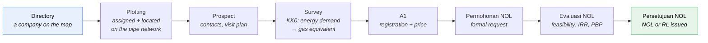
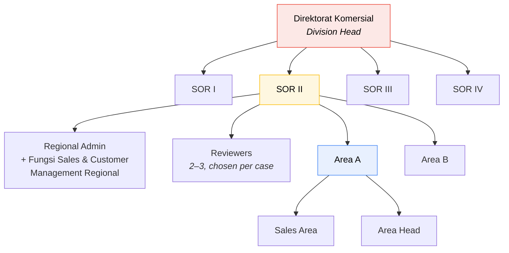

# Domain 01 — Overview & Glossary

**Application name: `DMS - Simando`.**

## The problem

From the client meeting ([`notulen.txt`](../notulen.txt)):

> *Orang perusahaan tidak bisa memonitor workflownya statusnya dah sampai mana,
> bagaimana progressnya belum jelas.*
> — People in the company can't monitor where a case has got to in the workflow;
> progress isn't visible.

**Data entry is most of what the system does. Status visibility is why it
exists.** Those are not in tension — the first is the means, the second is the end,
and it is worth being precise about the difference because it drives what gets
built first.

By volume, this is a data-entry application. Sales Area lives in forms: the KK0
survey alone has ~60 fields and four repeating groups, and stages 1–6 are almost
entirely capture. That work is real and the forms deserve to be good.

But **that data entry is not new work.** PGN already collects every one of those
fields — on paper forms defined in an official 211-page procedure, in spreadsheets,
in Word files sent by email. The system does not add data entry so much as
*relocate* it. What it adds is the thing that relocation makes possible: a single
place where you can see, at any moment, which prospect is at which step, who is
sitting on it, and how long it has been there.

So the test for a design decision is not "does this avoid data entry" — it is:
**does capturing this here make the state of a case visible?** Where the answer is
no, the field is probably being collected out of completeness rather than need.

The secondary jobs are: put the pipeline on a **map**, replace loose spreadsheets
and emailed Word files with one record per prospect, and route approvals through
a configurable chain instead of manual email.

## What the system is

A single long-lived record per prospective customer (*calon pelanggan*) that
accumulates data, documents and approvals across 8 stages.

It is **not** eight separate applications. This is the single most important
architectural fact and it drives the data model in
[data-model.md](../design/data-model.md).

## The 8 stages

From the header row of `Entry Apps` (`C2:M3`). Every field in that sheet is
tagged with the number of the stage that owns it.

| # | Stage | Purpose | Owner |
|---|---|---|---|
| 1 | **Directory** | Register the company: name, location, production type | Sales Area |
| 2 | **Plotting** | Assign a sales rep; place on map against pipe route & industrial zone | Sales Area |
| 3 | **Prospect** | Company PICs; plan the survey | Sales Area |
| 4 | **Survey** | On-site survey → **KK0**; measure energy demand, convert to gas | Sales Area |
| 5 | **A1** | Registration: usage periods, start month, gas price. Signed document uploaded | Sales Area |
| 6 | **Permohonan NOL** | Formal NOL request + Lampiran 17 evaluation; contract min/max, connection cost, capex | Sales Area → Area Head |
| 7 | **Evaluasi NOL** | Feasibility: final capex, pipe sizing, MRS spec, IRR / NPV / Payback → Resume Evaluasi | Regional Admin (SOR) |
| 8 | **Persetujuan NOL** | Reviewers, then sign-off; **NOL** or **RL** issued | Reviewers → Division Head |

`Sheet1` confirms the first three:

> 1. *Direktory Industri* — Input Data Industri (Nama, Lokasi, Jenis Produksi)
> 2. *Plotting Data* — Memetakan lokasi Industri
> 3. *Potensi* — Melakukan Visit Pertama, info kebutuhan energi

`Sheet1` calls stage 3 **Potensi** while the header row calls it **Prospect**.
The UI uses **Prospect** everywhere, including the promote action on the
Plotting screen.

## Actors

Reconciled from `notulen.txt` (authoritative), the docx annotations, and the
official swimlanes on *Diagram Alir 6.1* (`Calon Pelanggan | Area | SOR | Fungsi Lain`).

Listed in **approval-chain order**.

| # | Role | Does what | Sees |
|---|---|---|---|
| 1 | **Sales Area** | Creates and updates everything in stages 1–6. Runs surveys, drafts A1, the Lampiran 17 evaluation and the NOL request. Creator in the chain. | Own **Area** |
| 2 | **Area Head** | Approves the Area's work. **Endpoint at Lampiran 17** (*"Area head hanya sampe lampiran 17 resume evaluasi"*) — no action beyond it. | Own Area |
| 3 | **Regional Admin (SOR)** | Completes the data the Area entered, owns the **feasibility analysis** and the Resume Evaluasi, and **chooses the reviewers**. | Whole **Region** |
| 4 | **Reviewer** | 2–3 reviewers, chained in sequence. Named in the docx as *PIC Area Support* then *PIC Leader Area Support*. | Own Region |
| 5 | **Division Head** | Final approval → NOL or RL. On the official Nota Dinas this is *Direktur Komersial / General Manager, Sales and Operation Region*. | Whole Region |
| — | **Admin** | Master data only: regions, industry types, reference catalogues (segments, fuel types, meter sizes, MRS specs), users. No prices, conversion factors or workflow templates to manage — those are manual entry or per-case, not admin-editable ([master-data](master-data.md#2-complete-inventory)). | All |

Three facts that shape the whole design:

1. **Area Head acts before Regional Admin; reviewers act after.** This is what
   makes the chain coherent — Regional Admin *chooses* the reviewers, so they
   must act before the reviewers do. It also matches the official *Diagram Alir
   6.1*, which hands off from the **Area** lane to the **SOR** lane at step 3a
   and keeps all analysis in the SOR lane.
2. **The reviewer chain is configurable, not fixed.** *"Bisa dipilih reviewernya
   siapa saja bisa 2-3 reviewer"* — Regional Admin picks reviewers per case. The
   docx's named pair is one *instance*, not the schema.
3. **Visibility is hierarchical, and visible ≠ actionable.** *"area head regional
   bisa melihat 1 region itu tapi sales area spesifik hanya bisa melihat area
   tersebut"* — Region-level roles see the whole region; Area-level roles see only
   their area. Separately, Area Head can *see* their records at every stage but
   can only *act* at their one step. Row-level security, not a UI concern. See
   [approval-workflow.md](../design/approval-workflow.md#visibility-rbac).

### Organisational hierarchy

**SOR** = *Sales and Operation Region*, numbered I–IV on the official Nota Dinas.
Every record belongs to exactly one **Area**, which belongs to one **Region**.
Both the approval chain and data visibility resolve from that.

## Scope

### In scope

- The 8-stage pipeline with every field from `Entry Apps`
- **Map view with manual pin-drop**, available from stage 1 onward — explicitly
  requested three times in the notulen (*"tampilkan di map"*, *"tunjukkan di
  map"*, *"ditunjukkan di map yang sudah status ini"*)
- KK0 survey form (17 sections) as a digital form with printable output
- A1 registration: **download as Word → sign outside the system → re-upload**
  — the same loop KK0 already uses
- Permohonan NOL, Evaluasi, Resume Evaluasi and NOL/RL as generated documents
- The approval chain — Area Head, Regional Admin, 2–3 configurable reviewers,
  Division Head — with the three transitions (setuju / revisi / tolak)
- Document upload as evidence gates between stages
- Master data: regions, industry types, segments
- FEED tracked as a **checkpoint** on the evaluation, not as a process

### Out of scope

- Everything after NOL issuance: connection-cost payment, **PJBG** signing,
  infrastructure installation, gas-in, metering, billing. These are steps 3d–5
  of the official procedure — see [02-process-flow.md](02-process-flow.md).
- Integration with PGN's ERP/billing.
- A customer-facing portal. Every actor is internal PGN; the *Calon Pelanggan*
  participates on paper only.
- The **Gate Review** system itself. Its outputs (capex, pipe sizing, meter
  capacity) are entered manually in v1 — see
  [docs/future](../future/README.md#gate-review-integration).
- The **FEED** engineering process, owned by *Fungsi Infrastruktur*.
- **Pipeline network geometry** on the map — PGN cannot supply it; pipe-situation
  drawings are handled as document uploads instead.
- **Amendment / extension** of existing customers' agreements, pending
  confirmation — see [docs/future](../future/README.md#amendment--extension-workflow).
- **Allocation / gas-balance capacity tracking.** PGN already tracks
  realisasi vs alokasi BBTUD in their own spreadsheet; this platform doesn't
  rebuild that tool, only the one figure the workflow needs — see
  [design/reporting](../design/reporting.md#allocation--gas-balance--not-rebuilt-in-system).

## Glossary

| Term | Meaning |
|---|---|
| **NOL** | **No Objection Letter** — *Surat Pernyataan Tidak Keberatan*. The approval that lets a subscription proceed. Confirmed verbatim on Lampiran 15. |
| **RL** | **Refusal Letter** — the negative outcome. NOL and RL are issued by the same act (Lampiran 16), so the workflow has two terminal states, not one. |
| **A1** | Stage 5 registration. Corresponds to **Lampiran 11 — Formulir Registrasi Berlangganan Gas**. Filled outside the system, signed, and uploaded. |
| **KK0** | The on-site survey form — **Lampiran 10**, titled *DATA SURVEY PASAR*. Signed by both *Petugas Survei* and *Pemberi Data* (the customer). |
| **PJBG** | *Perjanjian Jual Beli Gas* — the gas sale & purchase agreement, signed after NOL. Out of scope but referenced by the evaluation. |
| **SOR** | *Sales and Operation Region* (I–IV). The "Regional" layer in the notulen. |
| **Capel** | *Calon Pelanggan* — prospective customer. |
| **RKAP** | *Rencana Kerja dan Anggaran Perusahaan* — the annual corporate work plan & budget. The evaluation records whether a prospect is RKAP or Non-RKAP. |
| **BBTUD** | Billion British Thermal Units per Day. Unit on the `Ketersediaan Pasokan` field in the evaluation's supply analysis. |
| **MRS / MR/S** | Metering & Regulating Station. Its **G-Size**, pressure and max flowrate are set during evaluation. |
| **FEED** | *Front End Engineering Design*, produced by *Fungsi Infrastruktur* before the feasibility analysis. Establishes pipe routing, MRS location and specification, and the capex estimate. Tracked here as a checkpoint only. |
| **Gate Review** | The cross-functional investment review (commercial, operations, infrastructure) that produces total capex, pipe specs, meter capacity and implementation duration. **GR3** is its third gate. |
| **Capex** | Connection capital expenditure. Estimated at A1 (*Perhitungan Capex Awal*), refined pre-GR3, finalised at evaluation (*Capex - data Final*). |
| **Biaya Penyambungan** | Connection fee charged to the customer. Split *Reguler* + *Extra*. |
| **Jaminan Pembayaran (JP)** | Payment guarantee. Alternative scheme: *Pembayaran Dimuka* (advance payment). |
| **SiGas** | A pricing scheme alongside *Reguler* and *Bersyarat*. Requires an uploaded **MOM** (*Minutes of Meeting*) *Penetapan Harga SiGas*. |
| **Reguler / Bersyarat** | Standard vs conditional pricing. *Bersyarat* requires the conditions and the reason to be stated (*Alasan Kontrak Bersyarat*). |
| **Harian / Bulanan / Tahunan** | Daily / Monthly / Yearly — the three contract bases (*Basis Kontrak*), each with its own price column. Daily basis requires a per-weekday min/max table. |
| **Segment / Sub-Produk** | Customer tier: `Bronze 1`, `Bronze 2`, `Bronze 3`, `Silver`, `Gold`, `Platinum`. Abbreviated `B1`–`B3` in worksheet examples. Price is typed per record, not looked up from the segment. |
| **Kode Harga** | Price code — identifier of the applied tariff row, printed on the NOL. |
| **Posisi Pelanggan** | *Pengembangan* (needs new pipe) or *Jalur Existing* (on an existing route). |
| **Kawasan** | *Kawasan Industri* (industrial estate) or *Non Kawasan Industri*. |
| **Titik Taping** | The tap point on the existing network proposed for this customer. |
| **Pipa Induk / Cabang / Servis** | Main / branch / service pipe. Length in m, diameter in inch or mm. |
| **Beban Puncak** | Peak load window(s) — start and end times of peak consumption. |
| **Konversi ke Gas** | Conversion of existing fuel consumption (coal, HSD, LPG…) into equivalent gas demand. The core sizing number — see [04](04-prospect-survey.md#the-conversion-engine). |
| **BPS** | *Badan Pusat Statistik* — the national statistics agency backing the `Jenis Produksi` dropdown. |
| **Nota Dinas** | Internal official memorandum. The NOL request and issuance are both Nota Dinas. |

## Key design implications

1. **Status is the product.** A prominent, always-visible status per record, plus
   a timeline of who did what and when. Build this first, not last.
2. **One record, many stages.** Fields accumulate; the record must be saveable
   and resumable at any point. Nothing is a wizard that must finish in one sitting.
3. **Stage number is data, not code.** Field visibility, required-ness and edit
   permission derive from `current_stage` vs `field.stage`. See
   [02-process-flow.md](02-process-flow.md#stage-gate-rules).
4. **Documents gate transitions.** *"Kalau mau naik status harus upload dokumen di
   luar system untuk bukti kelayakan"* — you cannot advance without uploading the
   external evidence. This is a hard rule, enforced server-side.
5. **Two terminal states.** NOL (approved) and RL (refused). Plus *Penundaan
   Berlangganan* (deferral) in the official flow.
6. **Repeating groups everywhere.** *"Insert Row jika > 1"*, *"jika ada lebih dari
   1 periode maka bisa add row"*, 4× raw materials, 4× market orientation, 2× PIC,
   N× equipment, 7× weekday rows. The form engine must handle dynamic row sets.
7. **The forms are legally prescribed.** They come from procedure `O-001/06.02`.
   Generated `.docx` documents must match the official layout, including the
   doc-number header block. Field names should not be "improved".
