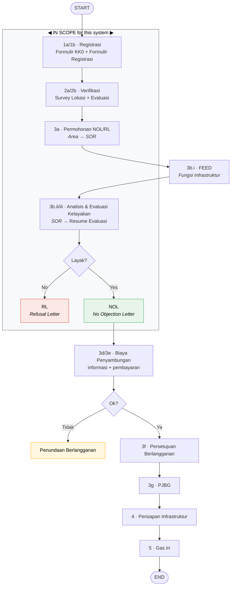
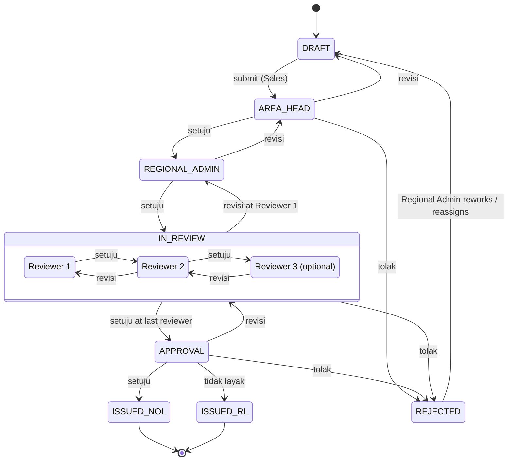
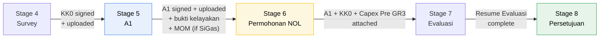

# Domain 02 — End-to-End Process Flow

## Two flows, one system

There are two process descriptions in play, and they must be kept distinct:

- **PGN's official procedure** (`Diagram Alir 6.1 Registrasi Berlangganan Gas`,
  procedure `O-001/06.02` p.66) — the legally binding business process, spanning
  from first explanation to gas-in.
- **The app's 8 stages** (`Entry Apps` sheet) — what this system tracks.

The app covers **procedure steps 1 through 3c**. Everything after NOL issuance is
out of scope.

### The official procedure

Swimlanes: `Calon Pelanggan | Area | SOR | Fungsi Lain`.

| Step   | Activity                                                 | Lane                   | Artefact                           |
| ------ | -------------------------------------------------------- | ---------------------- | ---------------------------------- |
| 1a     | Penjelasan ketentuan berlangganan gas ke Calon Pelanggan | Calon Pelanggan → Area | **Formulir KK0**                   |
| 1b     | Proses Registrasi Berlangganan Gas                       | Calon Pelanggan → Area | **Formulir Registrasi**            |
| 2a     | Survey Lokasi                                            | Area + Fungsi Lain     | —                                  |
| 2b     | Evaluasi Registrasi Berlangganan Gas                     | Area                   | Lampiran 17                        |
| 3a     | Permohonan NOL/RL                                        | Area → SOR             | **Permohonan NOL** (Nota Dinas)    |
| 3b.i   | Fungsi Infrastruktur menyusun FEED                       | Fungsi Lain            | FEED                               |
| 3b.ii  | SOR melakukan analisis dan evaluasi kelayakan            | SOR                    | **Resume Evaluasi**                |
| 3b.iii | SOR memberikan rekomendasi penandatanganan NOL/RL        | SOR                    | —                                  |
| —      | **Layak?** decision                                      | SOR                    | → Yes: NOL · → No: RL              |
| 3c     | Penandatanganan NOL/RL                                   | SOR → Area             | **NOL** or **RL**                  |
| 3d     | Informasi Biaya Penyambungan                             | SOR → Area → Capel     | Surat Informasi Biaya Penyambungan |
| 3e     | Pembayaran Biaya Penyambungan                            | Calon Pelanggan        | —                                  |
| —      | **Ok?** decision                                         | Area                   | → No: _Penundaan Berlangganan_     |
| 3f     | Persetujuan/Penundaan Berlangganan Gas                   | Area → Capel           | Persetujuan Berlangganan           |
| 3g     | Proses Penandatanganan Perjanjian                        | Area → Capel           | **PJBG**                           |
| 4      | Persiapan Infrastruktur Penyaluran Gas                   | Fungsi Lain + Capel    | —                                  |
| 5      | Pelaksanaan _gas in_                                     | Area + Fungsi Lain     | —                                  |



Note `FEED` and the infrastructure work sit in **Fungsi Lain** — a function the
app does not model. The system records FEED as a _checkpoint_ (`belum` /
`dalam_proses` / `selesai`, plus a document slot) on the evaluation, without
owning the process. Regional Admin cannot complete the feasibility analysis
until FEED is done, so its status is a genuine blocker worth showing on the
timeline.

### Mapping app stages onto the procedure

| App stage         | Procedure step    | Note                                              |
| ----------------- | ----------------- | ------------------------------------------------- |
| 1 Directory       | _(pre-procedure)_ | Prospecting; not in the official flow at all      |
| 2 Plotting        | _(pre-procedure)_ | Prospecting                                       |
| 3 Prospect        | _(pre-procedure)_ | First visit                                       |
| 4 Survey          | 1a + 2a           | Produces KK0                                      |
| 5 A1              | 1b                | Produces Formulir Registrasi (Lampiran 11)        |
| 6 Permohonan NOL  | 2b + 3a           | Evaluation at Area level + the Nota Dinas request |
| 7 Evaluasi NOL    | 3b                | SOR analysis → Resume Evaluasi                    |
| 8 Persetujuan NOL | 3c                | NOL or RL signed                                  |

Stages 1–3 are pure sales prospecting that PGN's procedure doesn't cover — which
is precisely why they were living in spreadsheets.

## Record lifecycle

### Status state machine

The three transitions are given directly by the notulen:

> 1. Setuju → naik 1 tingkat _(approve → up one level)_
> 2. Tolak → langsung balik ke admin regional _(reject → straight back to Regional Admin)_
> 3. Revisi → turun 1 tingkat _(revise → down one level)_

This is unusual and worth being precise about: **reject does not return to the
creator, it returns to the Regional Admin.** Revise steps back exactly one level.
Both must be implemented as written.



`REJECTED` sits in Regional Admin's queue. It is a working state, not terminal —
only `ISSUED_NOL` and `ISSUED_RL` are terminal. Full detail in
[approval-workflow.md](../design/approval-workflow.md).

### Status vocabulary

Actions on the record, from the docx annotations
(`SAVE / APPROVED / REVISION / REJECT`) and the notulen:

| Action                | Who          | Effect                                                     |
| --------------------- | ------------ | ---------------------------------------------------------- |
| `SAVE`                | Creator      | Persist as draft; no state change                          |
| `SUBMIT`              | Creator      | `DRAFT → AREA_HEAD`, chain snapshotted, Area Head notified |
| `SETUJU` / `APPROVE`  | any approver | Advance one level                                          |
| `REVISI` / `REVISION` | any approver | Step back one level; **comment required**                  |
| `TOLAK` / `REJECT`    | any approver | Jump to Regional Admin; **reason required**                |

A comment is mandatory on both `Revisi` and `Tolak`, enforced server-side. A
reviewer chain without recorded reasons defeats the visibility goal.

## Stage-gate rules

A record advances stage by stage. Two independent gates apply.

### Gate A — required fields

Each stage owns a set of fields (tagged in `Entry Apps`). A record may not
advance past stage _N_ until every field tagged `stage ≤ N` that is marked
required is filled. Fields marked `*` in the worksheet are the mandatory ones —
e.g. `Entry Apps!G25` (`PIC Nama`), `G26` (`Jabatan`), `F42` (`Produk Utama`),
`F81` (`Pipa Gas Terdekat`).

### Gate B — required documents

From the notulen:

> _Kalau mau naik status harus upload dokumen di luar system untuk bukti kelayakan,
> baru bisa naik status ke Permohonan NOL._

Documents are hard prerequisites for transitions:

| Transition                | Required upload                                                  | Source                                               |
| ------------------------- | ---------------------------------------------------------------- | ---------------------------------------------------- |
| Survey → A1               | Signed **KK0** (scan)                                            | notulen; Lampiran 10                                 |
| A1 → Permohonan NOL       | Signed **A1 / Formulir Registrasi** (scan, or signed externally) | notulen ("Formulir di upload hingga naik status A1") |
| A1 → Permohonan NOL       | **Bukti kelayakan** — external feasibility evidence              | notulen                                              |
| A1 → Permohonan NOL       | **MOM Penetapan Harga SiGas**, _if_ pricing scheme = SiGas       | `Entry Apps!K100`                                    |
| Permohonan NOL → Evaluasi | **A1** and **KK0** attached to the request                       | `Entry Apps!K114`, `K115`                            |
| Permohonan NOL → Evaluasi | **Biaya Capex Pre GR3** document                                 | `Entry Apps!K113`                                    |



Enforce both gates **server-side**, on the transition endpoint. A greyed-out
button in the UI is a convenience, not the control.

### Who owns which stage

Editing rights change hands as the record advances — this is the part most likely
to be got wrong:

| Stage / state        | Editable by           | Notes                                                                                                                                       |
| -------------------- | --------------------- | ------------------------------------------------------------------------------------------------------------------------------------------- |
| 1–6, `DRAFT`         | Sales Area (own area) | Creator owns the record                                                                                                                     |
| Awaiting Area Head   | **Nobody**            | Read-only; changes only via `Revisi` returning it to the creator |
| 7, at Regional Admin | **Regional Admin**    | _"data analisis kelayakan posisinya di regional admin"_ and _"bagian regional melengkapi data yang sudah diinput dari area"_                |
| 8, with reviewers    | **Nobody**            | Reviewers comment only; edits happen by sending the record back                                                                             |
| 8, at Division Head  | **Nobody**            | Approve / reject only                                                                                                                       |

The handover at stage 7 is a genuine ownership transfer, not just a permission
change. The Area can no longer edit; the Region takes over and fills the gaps.
Regional Admin is the only actor who both edits and approves.

## The status timeline

Since visibility is the point, every record carries an append-only event log
rendered as a timeline:

```
● 2026-08-01 09:14  Sales Area (Budi)      Created · Directory
● 2026-08-03 14:22  Sales Area (Budi)      Advanced → Plotting
● 2026-08-11 10:05  Sales Area (Budi)      Advanced → Survey · KK0 uploaded
● 2026-08-20 16:40  Sales Area (Budi)      Advanced → A1 · Formulir Registrasi (ttd, diunggah)
● 2026-08-21 08:00  Sales Area (Budi)      Submitted for approval
◐ 2026-08-21 08:00  Area Head (Sari)       ⏱ awaiting approval — 3 days
○                   Regional Admin         pending
○                   Reviewer 1             pending
○                   Reviewer 2             pending
○                   Division Head          pending
```

The "⏱ awaiting review — 3 days" element is what answers the client's problem
statement. Ageing per step should also drive the dashboard —
see [reporting.md](../design/reporting.md).
