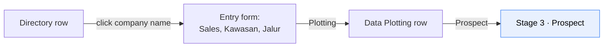

# Domain 03 — Stages 1–2: Directory & Plotting

These two stages are pure sales prospecting. They have no equivalent in PGN's
official procedure — which is exactly why they've been living in spreadsheets and
why the client wants them on a map.

---

## Stage 1 — Directory

> *Directory - database perusahaan besar, yang berminat mana saja tempatnya,
> tampilkan di map* — a database of large companies; where the interested ones
> are; show them on a map. (`notulen.txt`)

`Sheet1` defines it as: *Input Data Industri — Nama, Lokasi, Jenis Produksi*.

### Fields

| Field | Type | Rule | Source |
|---|---|---|---|
| `Nomor` | text, auto | **Auto-generated** — see below | `Entry Apps!D5, F5, N5:N6` |
| `Nama Perusahaan` | text | Entry. e.g. `PT INDONESIA 1945` | `D7` |
| `Website` | url | Entry. e.g. `www.indonesia1945.com` | `D9` |
| `Provinsi` | select | Dropdown: Prov | `F11`, `N11` |
| `Kota/Kabupaten` | select | Dropdown, cascades from Provinsi | `F12`, `N12` |
| `Kecamatan` | select | Dropdown, cascades from Kota/Kab | `F13`, `N13` |
| `Kelurahan/Desa` | select | Dropdown, cascades from Kecamatan | `F14`, `N14` |
| `Alamat` | text | Entry. e.g. `Jalan Pemuda 56 - 58` | `F15`, `N15` |
| `Jenis Produksi` | select | Master data — BPS/KBLI if PGN can supply it, otherwise the 20 curated categories; extensible either way | `D17`, `N17` |
| `Koordinat` | latlng | **Manual pin-drop on a map**, available from this stage. Not in the worksheet, but KK0 §2 has `Tagging` and Lampiran 10 §4 has `Titik Koordinat: Longitude / Latitude`, so it exists in the paper flow | notulen; Lampiran 10 §4 |

### The Nomor format

A **single global sequence**, with the BPS codes carried as an informational
suffix.

```
{seq:0000000}-{BPS Provinsi code}-{BPS Kota/Kabupaten code}

e.g.  0000001-35-78     Kota Surabaya, Jawa Timur
      0000002-35-15     Kabupaten Sidoarjo — same sequence, continues
      0000003-32-73     Kota Bandung, Jawa Barat — still the same sequence
```

- The 7-digit sequence is **global across all records**, not restarted per region.
- `Kode Prov` / `Kode Kab` are the **official BPS/Kemendagri codes** — so Jawa
  Timur is `35`, not the `15` in the worksheet's sample. The worksheet's own note
  *"(Urutan Prov dan Urutan Kab)"* is superseded.
- The codes are **descriptive, not part of the uniqueness key**. `seq` alone is
  already unique; the suffix just makes the number readable at a glance.

### Allocating the number

A global sequence makes this straightforward — use a plain PostgreSQL sequence:

```sql
create sequence company_nomor_seq start 1;

-- allocation is a single atomic, lock-free call
select nextval('company_nomor_seq');
```

`nextval()` is atomic and never blocks, so concurrent creation is safe by
construction: no counter table, no `SELECT … FOR UPDATE`, no contention hot-spot.

In EF Core, map it with `.UseHiLo()` or `.HasDefaultValueSql("nextval(...)")`;
none of the transaction handling the per-region scheme would have needed applies.

> **The trade-off is gaps.** PostgreSQL sequences are non-transactional, so a
> rolled-back insert burns its value and `0000042` may never exist. Since the
> number is allocated on first save, a gap simply means a company creation
> failed — acceptable for an internal reference. If PGN later requires a
> **gapless** series, the only safe alternative is a single counter row locked
> with `FOR UPDATE`, which serialises *every* record creation system-wide on one
> row. At this volume that is still workable, but it is strictly slower and more
> fragile than `nextval()`.

### Storing and re-rendering

Store the sequence value and the rendered string separately:

| Column | |
|---|---|
| `nomor_seq` | integer, from the global sequence — the real identity |
| `nomor` | varchar, unique — the rendered `{seq}-{prov}-{kab}` string |

Keeping `nomor_seq` means a corrected address only re-renders the suffix; the
record keeps its identity.

- Allocate `nomor_seq` on **first save**, not on form open.
- While the record is `DRAFT` and no document has been generated, changing the
  Kota/Kabupaten **re-renders `nomor`** with the new codes. `nomor_seq` never
  changes.
- Once the record leaves `DRAFT`, `nomor` is **frozen** — it appears on signed
  documents. A later address correction must not alter it.

> ⚠️ **This is hard to reverse.** Switching to per-region sequences later would
> require renumbering every existing record, which is impossible once numbers are
> on issued NOLs — so PGN would end up with a mixed scheme. Worth a quick
> confirmation that "global" is the intended long-term answer and not just the
> convenient one.


### Screen: `Directory Industry`

```
┌──────────────────────────────────────────────────────────────────────────────┐
│  DATA INDUSTRI DI INDONESIA                                    [ + Tambah ]  │
├──────────────────────────────────────────────────────────────────────────────┤
│  Filter:  [Prov ▾] [Kota/Kab ▾] [Kec ▾] [Kel/Desa ▾] [Jenis Produksi ▾]      │
│           Jawa Timur  Kendal     Dawu   Jombok       Semua                   │
├─────┬────────────────────────┬─────────────────────┬─────────────────────────┤
│ No  │ Nama                   │ Produksi            │ Action                  │
├─────┼────────────────────────┼─────────────────────┼─────────────────────────┤
│  1  │ PT Big Note            │ Kertas              │ [Plotting][Edit][Delete]│
│  2  │ PT Desa Makmur         │ Bahan Tekstil       │ [Plotting][Edit][Delete]│
│  …  │ …                      │ …                   │ …                       │
└─────┴────────────────────────┴─────────────────────┴─────────────────────────┘
```

Source: `Directory Industry` sheet, rows 2–15.

**Behaviour**

- **Every filter has a `Semua` (All) option.** Confirmed by cell comments on
  `Directory Industry!F3, G3, I3` (*"Ada Pilihan : Semua"*) and `E3`
  (*"All Provinsi"*).
- Region filters cascade: Prov → Kota/Kab → Kec → Kel/Desa.
- Clicking the **company name** opens the entry form to complete plotting data:
  > *"Klik Nama Industri, akan masuk ke Form Entry untuk melengkapi Data: Sales,
  > Kawasan, Jalur"* (`Directory Industry!E6`)
- After completing it, the `Plotting` action becomes available:
  > *"setelah Selesai, bisa memilih Plotting"* (`E7`)
- Actions: `Plotting` · `Edit` · `Delete` (`L6:L8`).
- Clicking a company also opens `Posisi Pelanggan` — the worksheet's *"melengkapi
  Data: Sales, Kawasan, **Jalur**"* refers to this one field, not a separate one.

**Map view.** The same dataset rendered as pins, filtered by the same controls.
Pin colour by stage (see [reporting.md](../design/reporting.md#the-map)).

---

## Stage 2 — Plotting

`Sheet1`: *Plotting Data — Memetakan lokasi Industri* (mapping the industry's
location).

### Fields

| Field | Type | Options | Source |
|---|---|---|---|
| `Plotting By` | select | Dropdown: **Nama Sales** | `Entry Apps!D19`, `N19` |
| `Posisi Pelanggan` | radio | `Pengembangan` · `Jalur Existing` — **one field, see below** | `D21`, `F21`; `Data Plotting!D5, J3` |
| `Kawasan` | radio | `Kawasan Industri` · `Non Kawasan Industri` | `D23`, `F23` |

`Plotting By` is the sales assignment — it determines who owns the record and,
combined with the user's Area, who can see it.

### `Posisi Pelanggan` and `Jalur Pipa` are one field

The worksheet appears to have two fields:

| Where | Label | Values |
|---|---|---|
| `Entry Apps!D21` — the entry form | `Posisi Pelanggan` | `Pengembangan` · `Jalur Existing` |
| `Data Plotting!D5, J3` — the list column and filter | `Jalur Pipa` | `Existing` · `Pengembangan` |

Same two concepts, captured twice — the entry-form label and the list-screen label
for one underlying attribute. **Store one column.**

```
posisi_pelanggan  enum(pengembangan, jalur_existing)
```

**Canonical label: `Posisi Pelanggan`**, used on the entry form, the Plotting list
column header, and the filter. `Entry Apps` is the field-definition sheet, and the
term is the more precise of the two — it describes where the customer sits
relative to the network, which is exactly what the values say.

> **Visible change to flag with the client:** the Plotting screen's column header
> and filter change from `Jalur Pipa` to `Posisi Pelanggan`. If they would rather
> keep seeing `Jalur Pipa` on that screen, it is a display-label config on one
> column — not a second field. Do not reintroduce a second column for it.

### Screen: `Data Plotting`

```
┌──────────────────────────────────────────────────────────────────────────────────┐
│  DATA INDUSTRI DI INDONESIA                                                      │
├──────────────────────────────────────────────────────────────────────────────────┤
│  Filter: [Prov ▾][Kota/Kab ▾][Kec ▾][Kel/Desa ▾][Posisi Pelanggan ▾][Kawasan ▾] │
│          Jawa Timur Kendal    Dawu  Jombok      Jalur Existing      Kwsn Industri │
├─────┬──────────────────────┬───────────────────┬────────────────┬────────────────┤
│ No  │ Nama                 │ Produksi          │ Posisi Plgn.   │ Action         │
├─────┼──────────────────────┼───────────────────┼────────────────┼────────────────┤
│  1  │ PT Big Note          │ Kertas            │ Jalur Existing │ [Prospect]     │
│  2  │ PT Desa Makmur       │ Bahan Tekstil     │ Pengembangan   │ [Prospect]     │
│  4  │ PT Fasad Indah       │ Kaca              │ Jalur Existing │ [Edit]         │
│  7  │ PT Indah Kejora      │ Kimia             │ Jalur Existing │ [Save]         │
└─────┴──────────────────────┴───────────────────┴─────────────┴───────────────────┘
```

Source: `Data Plotting` sheet, rows 2–15.

**Behaviour**

- Two extra filters vs Directory: `Posisi Pelanggan` (labelled `Jalur Pipa` in
  the worksheet mock) and `Kawasan`.
- `Semua` option again on the region filters (comments on `F3, G3, H3, J3`).
- Row actions vary by row state — the mock shows `Potensi`, `Edit` and `Save` on
  different rows, which reads as: `Save` while editing inline, `Edit` to re-open,
  and the promote action to **advance the record to stage 3**.
- **The promote action is labelled `Prospect`, not `Potensi`.**
- Side action menu: `Plotting` · `Edit` · `Save` (`M6:M8`).

### `Prospect` is the stage gate

The promote button is stage 2 → stage 3. `Sheet1` describes stage 3 as
*"Potensi — Melakukan Visit Pertama, info kebutuhan energi"* (first visit, energy
demand info). Pressing it asserts "this is a genuine potential customer, schedule
the visit".

The worksheet labels this button `Potensi`; **the UI uses `Prospect`**, matching
the stage name.



---

## Notes for implementation

- Directory and Plotting are **views of the same record**, not separate tables.
  A company appears in Directory from creation and in Plotting once stage ≥ 2.
- The `Jalur Pipa` column is blank in every mock row while also being a filter —
  it is populated during plotting and the filter matches on it. It is a
  **two-value list**, not a master table of named routes, and it is the **same
  field** as `Posisi Pelanggan`.
- Delete is offered in Directory. Records that have advanced past stage 2 carry
  approvals and documents — soft-delete only, and block deletion once a record
  has ever been submitted `[ASSUMPTION]`.
- Coordinates are set by **dropping a pin on a map** from stage 1 onward, so both
  the Directory and Plotting screens need a map mode alongside the table.
