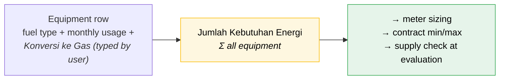

# Domain 04 — Stages 3–4: Prospect & Survey (KK0)

---

## Stage 3 — Prospect

> *Prospect - rencana yang akan di survey* — the plan of what will be surveyed.
> (`notulen.txt`)

### `PIC Perusahaan` — repeating contact block

The worksheet shows **two** blocks (`Entry Apps!F25:G31` and `F33:G39`), identical
in structure. Treat as a repeating group, minimum 1.

| Field | Required | Source |
|---|---|---|
| `Nama` | **✱** | `F25` / `G25` |
| `Jabatan` | **✱** | `F26` / `G26` |
| `Email` | | `F27` |
| `No HP` | | `F28` |
| `Linkdin` | | `F29` |
| `IG` | | `F30` |
| `FB` | | `F31` |

The `*` markers in `G25`/`G26` are the worksheet's required-field notation.

Social handles (LinkedIn/IG/FB) as first-class contact fields is unusual but
deliberate — sales use them to research and reach decision-makers. Keep them.

---

## Stage 4 — Survey (KK0)

> *Survey - survey tempat yang potensial, yang sudah pernah disurvey dimana lalu
> tunjukkan di map* — survey the potential sites; show on the map where has
> already been surveyed. (`notulen.txt`)

This is the heaviest data-entry stage. It has **two overlapping definitions** and
they must be reconciled:

- The `KK0` sheet in the client's worksheet — 17 numbered sections.
- **Lampiran 10** of procedure `O-001/06.02` — the official *Formulir KK0 / DATA
  SURVEY PASAR*, 14 numbered sections plus a surveyor-only block.

They are close but not identical. **The official Lampiran 10 is authoritative for
the printed form**; the client's `KK0` sheet reflects how they actually want to
capture it. Differences are flagged below.

### The `Entry Apps` survey fields

These are the stage-4 fields as the app should capture them
(`Entry Apps` rows 42–81).

#### Produk Utama — repeating, up to 4 rows + note

| Field | Type | Hint | Source |
|---|---|---|---|
| `Produk` | text ✱ | *"Tuliskan produk utama"* | `F42:F45` |
| `Kapasitas` | number | unit `Kaps/Tahun` | `J42:J45` |
| `Catatan` | textarea | | `F46` |

#### Bahan Baku (raw materials) — repeating, up to 4 rows + note

| Field | Type | Hint | Source |
|---|---|---|---|
| `Bahan` | text | *"Tuliskan produk utama"* | `F48:F51` |
| `Impor/Lokal` | select | *"Drop list : Impor/Lokal"* | `H48:H51` |
| `Negara` | select | *"Drop down Negara"* | `J48:J51` |
| `Vol` | number | | `K48:K51` |
| `Satuan` | select | *"Drop down (%) atau (Ton/KL/m2) per Bulan"* | `M48:M51` |
| `Catatan` | textarea | | `F52` |

#### Orientasi Pasar (market orientation) — repeating, up to 4 rows + note

Identical structure to Bahan Baku, but `Negara` means destination country
(`Negara Tujuan`) rather than origin. Source: `F54:M57`, note at `F58`.

#### Operations

| Field | Type | Hint | Source |
|---|---|---|---|
| `Jumlah Karyawan` | number | unit `Orang`; *"Tulis angka"* | `D60`, `H60`, `F60` |
| `Shift` | select | *"Drop down (1, 2, 3)"* | `K60`, `J60` |
| `Jam Kerja` | number | `Jam / hari` | `D62`, `I62` |
| `Hari/Minggu` | number | | `K62` |

#### Kebutuhan Energi — multi-select + capacity/usage

| Field | Type | Options | Source |
|---|---|---|---|
| `Jenis` | checkbox (multi) | `Listrik` · `Steam` · `Panas` · `Dingin` · `Lainnya` | `F64:M64` |
| `Lainnya` | text | *"Tuliskan"* — free text when `Lainnya` checked | `M66` |
| `Kapasitas` | number + unit | `MW` · `Ton/Jam` · `Kkal` · `TR` | `E65`, `F66:K66` |
| — unit for TR | select | *"Dropdown : TR/PK/Kw"* | `K66` comment |
| `Pemakaian` | number + unit | `Kwh` · `Ton` · `Kkal` · `TR` | `E67`, `F68:K68` |

The checkbox list and the capacity/usage unit columns line up: pick `Steam` →
capacity in `Ton/Jam`; pick `Dingin` → capacity in `TR` (tons of refrigeration,
with `TR/PK/Kw` as alternatives).

#### Equipment table — repeating, `Insert Row jika > 1`

`Entry Apps!D70:M74`. This is the table that drives sizing.

| Column | Type | Hint | Source |
|---|---|---|---|
| `Kebutuhan Energi` | text | *"Entry :"* — equipment name | `D70`, `D72` |
| `Kapasitas / Unit` | number + unit | *"Memilih Unit"* | `F70`, `F72`, `G72` |
| `Pola Operasi — Jam` | number | hours/day | `H71` |
| `Pola Operasi — Hari` | number | days/week | `I71` |
| `Sumber Energi — Jenis` | select | fuel type | `J71` |
| `Sumber Energi — Pemakaian/Bulan` | number | | `K71` |
| `Sumber Energi — Unit` | select | *"Pilih Unit : Ton/Liter/Kwh"* | `L71`, `L72` |
| `Konversi ke Gas` | number | **Manual entry** — typed by the user, not calculated | `M70`, `M72`, `M73` |
| `Jumlah Kebutuhan Energi` | number | **`Otomatis`** — sum of the column | `D78` |

Worked example from the worksheet (`D72:L74`):

| Equipment | Capacity | Operation | Fuel | Usage/month |
|---|---|---|---|---|
| Steam Boiler | 4 Ton/Jam | 24 h × 7 d | Batubara | 100,000 Ton |
| Thermal Oil Heater | 1,000,000 Kkal | 8 h × 7 d | HSD | 30,000 Liter |
| Dryer | 750,000 Kkal | 8 h × 7 d | HSD | 20,000 Liter |

#### Pipa Gas Terdekat

| Field | Required | Source |
|---|---|---|
| `Jarak` | **✱** | `F80`, `F81` |
| `Diameter` | | `H80` |
| `Tekanan` | | `J80` |

Lampiran 10 records this as *"Estimasi Pipa Terdekat: … Meter"* in the
surveyor-only block, so `Jarak` is in metres.

---

## The conversion engine

**`Konversi ke Gas` is entered manually in v1**, not computed by the system.
The reference formula below still matters — it's what the figure represents,
and it's what a future automated version would compute from — but for now the
surveyor or Sales Area user types the number in directly, the same way it
would be worked out on the paper KK0.

The worksheet's own formulas, `KK0!K61:K63`, show the intended shape of the
number:

```
K61 = I61 * 6000 / 9000     ← Batu Bara: 70,000 Ton  → 46,666.67
K62 = I62 * 9000 / 9000     ← HSD:       30,000 Liter → 30,000
K63 = I63 * 9000 / 9000     ← HSD:       20,000 Liter → 20,000
K67 = SUM(K61:K66)                                    → 96,666.67
```

So conceptually:

> **`Konversi ke Gas` = `Konsumsi Energi/Bulan` × (calorific value of the fuel ÷
> calorific value of gas)**

with gas at **9,000** and coal at **6,000** in the same (per-unit) basis — this
is guidance for whoever fills in the field, not a formula the system runs or a
value the system stores anywhere.

The `6000` and `9000` are kcal per unit of the respective fuel (kcal/kg for coal,
kcal/m³ for gas). Lampiran 10's own footnote settles the output unit: **MMBtu per
month or m³ per month**.

The calorific values for the other 8 fuel types, and which gas basis to use, are
still open questions for PGN — but they no longer block anything, and v1
doesn't model or seed calorific values at all. If PGN supplies the full
table later and an automated cross-check becomes worth building, that's new
scope, not something waiting dormant in the schema today.

### The official conversion references

Procedure `O-001/06.02`, *Lampiran Formulir — Daftar Peralatan Gas*, gives PGN's
sanctioned equivalences:

| From | To |
|---|---|
| 10,85 Kwh | 1 m³/jam |
| 1 MMBtu/h | 28,5 m³/jam |
| 8.750 Kkal/jam | 1 m³/jam |
| 1 ton steam/jam | 70 m³/jam |

Note the tension: the official reference uses **8,750 kcal = 1 m³** while the
client's worksheet divides by **9,000** — quoted here purely so the number in
`Konversi ke Gas` is legible to a future reader, not because either figure is
stored anywhere.

`konversi_ke_gas` is a plain required number field on each equipment row,
typed by the user. **No `conversion_factor` table, no `gas_calorific_value`
constant, no calorific data at all in v1** — there's nothing in the system to
seed, override, or keep in sync, because nothing computes from it.



---

## The official KK0 form (Lampiran 10)

Printed output must match this. Title: **DATA SURVEY PASAR**. Header carries
`Formulir KK0` and `No. ………KK0/AREA ……/20……`.

### Section A — *Diisi oleh Pemberi Data* (filled by the customer)

| § | Field |
|---|---|
| 1 | Nama (Perusahaan/Grup) |
| 2 | Alamat — Kantor · Lokasi Pemasangan · Telepon (Kantor, Pabrik) · **Status kepemilikan** (per address) |
| 3 | Person In Charge (PIC) · No. HP |
| 4 | **Titik Koordinat — Longitude / Latitude** |
| 5 | Jenis Usaha/Produk |
| 6 | Jumlah Produksi — Jenis Produk · Sebanyak · /Tahun (3 rows) |
| 7 | Bahan Baku (%) — Dalam Negeri % · Luar Negeri % · Negara Asal % |
| 8 | Orientasi Pasar (%) — Dalam Negeri % · Luar Negeri % · Negara Tujuan % |
| 9 | Jumlah Karyawan Total (Orang) · Jumlah Shift per Hari |
| 10 | Jam Kerja Operasi — Jam/Hari · hari/minggu |
| 11 | Bahan Bakar Eksisting — LPG/HSD/MFO/CNG/LAINNYA · Nama Pemasok · Kapasitas Listrik (MW/KW) · Pemakaian Listrik (KWh) |
| 12 | **Minimum efisiensi yang diharapkan (%)** |
| 13 | Rencana Pemanfaatan Gas *(beri tanda X)* — Bahan Baku · Bahan Bakar · Pembangkit Listrik · CNG · Transportasi Gas · ……(sebutkan) |
| 14 | **Perincian Bahan Bakar Yang Dipakai Saat Ini** — table: NO · Jenis Peralatan · Kapasitas/Jam (Volume, Satuan) · Pola Operasi (Jam/Hari, Hari/Minggu) · Jenis Bahan Bakar\* · Harga Bahan Bakar · Konsumsi Energi/Bulan (Volume, Satuan) · **Konversi Ke Gas**\*\* · then `Jumlah Kebutuhan Energi` |
| — | Keterangan Lain Sebagai Informasi Tambahan (free text) |
| — | Signatures: **Pemberi Data** · **Petugas Survei** |

\* `LPG / Minyak Berat (FO) / Solar (HSD) / IDO / MDF / Minyak Tanah / Batu Bara /
Listrik / Lain-Lain (sebutkan)`
\*\* `Dalam satuan MMBtu/Bulan atau m³/Bulan`

**That footnote settles the output unit question**: `Konversi Ke Gas` is in
**MMBtu/month or m³/month**.

### Section B — *Diisi oleh Petugas Survei* (surveyor only)

| § | Field |
|---|---|
| 1 | **Willingness To Pay** — USD/MMBtu |
| 2 | **Estimasi Pipa Terdekat** — Meter |

`Willingness To Pay` appears nowhere in the client's worksheet but is
commercially significant — it feeds pricing, so it's included. Filled by
the surveyor, not the customer, so it must be hidden on the customer-facing
printout.

### Differences: client `KK0` sheet vs official Lampiran 10

| Item | Client sheet | Official Lampiran 10 |
|---|---|---|
| Section count | 17 | 14 + surveyor block |
| `Tagging` (map pin) | §2 | §4 `Titik Koordinat` (Long/Lat) — more explicit |
| `Beban Puncak` (peak load, 2 windows) | §10 | **absent** |
| `Kebutuhan Jasa/Produk` (Energi/Engineering/O&M) | §11 | **absent** |
| `Deskripsi Proses Produksi` | §15 | folded into *Keterangan Lain* |
| `Minimum efisiensi yang diharapkan` | **absent** | §12 |
| `Willingness To Pay` | **absent** | surveyor block |
| `Harga Produk` | §4 | **absent** |
| Fuel list | LPG, CNG, HSD, MFO, Batubara, Cangkang, Kayu, Lainnya | LPG, FO, HSD, IDO, MDF, Minyak Tanah, Batu Bara, Listrik, Lain-lain |

**Recommendation:** capture the **union** of both. The client's extra fields
(peak load, service needs, production process) are useful sales intelligence; the
official fields are mandatory for the printed form. The fuel master list should
be the union too — the client's `Cangkang` (palm kernel shell) and `Kayu` (wood)
are real Indonesian industrial fuels absent from the 2023 official list.

### Signature block

Both forms are signed by two parties: **Surveyor / Petugas Survei** and **Calon
Pelanggan / Pemberi Data** (`KK0!B70, H70, B73, H73`). Since KK0 must be uploaded
as a signed scan to pass the stage gate, the system generates the filled `.docx`
for printing, then accepts the signed scan back.

**For KK0, that sequence describes the artefact the gate requires, not the
chronological order of events.** The surveyor has no system access on-site
([frontend/12 — Responsive](../design/frontend/12-patterns-and-states.md#responsive):
"filled on paper at the site and transcribed at a desk"), so there is no
system-generated `.docx` yet at the moment of signing. Both parties sign the
**paper KK0 filled during the visit itself**. That signed paper — photographed
on-site via the mobile-supported upload flow, or scanned later
([frontend/12](../design/frontend/12-patterns-and-states.md#responsive)) — is
what gets uploaded to satisfy the gate. Typing the same data into the system,
and any `.docx` the system regenerates from it, happens afterward at a desk and
is a separate, unsigned step: it builds the structured record that feeds sizing
and reporting (see [the conversion engine](#the-conversion-engine) and the
equipment/load-profile fields above), not a second document that needs a second
customer visit or a second signature.

This download → sign → re-upload loop is the pattern for **every** signed document
in the system ([build/architecture — Document signing](../build/architecture.md#document-signing)),
but KK0 is the one case where the signed artefact predates the system record it
ends up attached to, rather than being produced from it.
