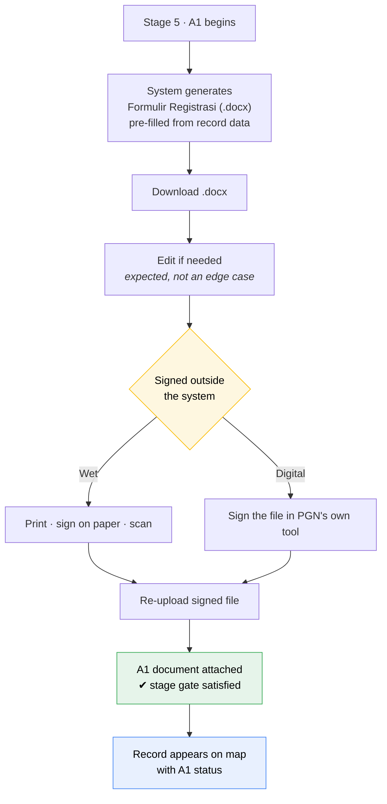

# Domain 05 — Stage 5: A1 / Registrasi Berlangganan

**A1** is the *Formulir Registrasi Berlangganan Gas* — **Lampiran 11** of
procedure `O-001/06.02`. It is the customer's formal application, and it is the
first point where money enters the picture.

## How A1 actually works

From the client meeting, verbatim:

> *A1 - ada form yang dikerjakan diluar sistem ini, discan upload sudah. Yang word
> bisa didownload lalu di sign basah atau langsung di web secara digital,
> ditunjukkan di map yang sudah status ini.*

Three requirements packed into one sentence:

1. The form is **filled outside the system**, scanned and uploaded.
2. The system offers a **Word download**, which is then signed — *sign basah* on
   paper, or digitally.
3. Records at A1 status are **shown on the map**.

Signing happens **outside the application in every case**. The client's
*"langsung di web secara digital"* is served by signing the
downloaded file in whatever tool PGN uses — not by a signing pad in the browser.
One path, not two:

The branch is **outside the system boundary** — the application does not know or
care which side was taken. It records `signature_method` as declared metadata
because it is worth knowing, not because it verifies it.

The generated document must be **.docx** — the client said "yang word" — because
staff still edit it before printing; no PDF version is generated. That editing is
why the re-uploaded file must never be validated against what we generated: it is
*supposed* to differ.

---

## Fields (`Entry Apps` rows 83–100)

### Registration

| Field | Type | Note | Source |
|---|---|---|---|
| `Regristrasi Berlangganan — Tanggal` | date | Comment: *"Bisa terisi dari data Registrasi Online / Input dari registrasi Manual"* — **can be auto-filled from online registration, or entered manually** | `D83`, `F83`, `H83` |
| `Nama Penanggung Jawab` | text | | `D85` |
| `Jabatan` | text | | `J85` |

The `H83` comment implies an online registration channel exists or is planned.
Registration is **manual entry only in v1**. `registrasi_source` is retained
as a field, fixed to `manual`, so an ingestion path can be added later
without a migration.

### Pemakaian Gas — repeating periods

> *"jika ada lebih dari 1 periode maka bisa add row"* (`K87`)

| Field | Type | Source |
|---|---|---|
| `Periode` — from | date (*"Date"* comment on `G87`) | `F87` |
| `Periode` — to (`s.d`) | date | `H87` |
| `Rata-rata` | number | `F88` |
| `Minimum` | number | `I88` |
| `Maksimum` | number | `K88` |

Multiple periods exist to express **ramp-up** — Lampiran 17 confirms this:
*"#untuk Registrasi Belangganan Gas, Jika terdapat pemakaian Gas ramp up …
Jumlah periode dapat disesuaikan dengan rencana ramp up."*

| Field | Type | Source |
|---|---|---|
| `Permohonan Bulan dimulai` | month | `D91` |

---

## Gas pricing

This is the commercially sensitive part. `Entry Apps` rows 93–98.

| Field | Type | Options | Source |
|---|---|---|---|
| `Basis Kontrak` | radio | `Harian` · `Bulanan` · `Tahunan` | `F93`, `H93`, `J93` |
| `Skema` | radio | `Reguler` · `SiGas` · `Bersyarat` | `F94`, `H94`, `J94` |
| `Segment` | select | `Bronze 1` · `Bronze 2` · `Bronze 3` · `Silver` · `Gold` · `Platinum` | `K93`; dropdown per comment on `L93` |
| `Kode Harga` | text/select | *"Drop down List, jika tidak ada bisa Input baru"* — dropdown, but a new value may be entered | `K94`, comment on `L94` |
| `Harga` | number + currency + unit | Typed directly — see below | `Entry Apps!O92:T98` shape, Lampiran 17 unit |
| `Perhitungan Capex Awal` | number/upload | | `D98` |

`Segment` is `Sub-Produk` on the official Lampiran 17 — same six values, same
order. The `Tabel` sheet exists solely to hold this list (`Tabel!A3:A8`).

### Manual entry only

**No `Mode` toggle, no price-matrix lookup, at A1 or NOL.** The worksheet's
`D94`/`D95` `Manual`/`Otomatis` radio and the *"Sesuai Data base"* comment on
`F95` describe an automatic path that depended on the `OUP`/`UMP` formula —
which no source defines and the client doesn't know either, so the automatic
side was never built. Every record is priced by hand: `Harga`, `Kode Harga`,
`Segment` and `Basis Kontrak` are plain fields, the same way they'd be
filled on paper.

`OUP` and `UMP` (`F96`, `H96`) are dropped entirely — they existed only to
feed the undefined formula, and there's no formula left for them to feed.

The same *"Sesuai Data base"* comment appears at `F110` on the NOL form; NOL
pricing is manual too, for the same reason.

### What the worksheet's price example shows

`Entry Apps!O92:T98` is a live worked example, not master data — there is no
`price_matrix` table behind `Harga` in v1. Kept here as context for whoever
is typing a price by hand:

| Segment | Bulanan (USD) | Tahunan (USD) | Harian (USD) |
|---|---|---|---|
| B1 | **10** | — | — |
| B2 | 9.66 | — | — |
| B3 | 9.50 | — | — |
| Silver | 9.26 | — | — |
| Gold | 9.18 | — | — |
| Platinum | 8.78 | — | — |

- The worksheet's `10,000` for B1 was a thousands-separator misread; the
  confirmed value is `10`, sitting exactly where the pattern predicts it —
  prices **decrease** as segment improves (B2 9.66 → Platinum 8.78), so B1
  is the most expensive at 10.
- The `Tahunan` and `Harian` columns were never populated in any source. No
  seed data, no gap to fill — a manual field just starts blank.

Lampiran 17 states the price unit explicitly: **`USD…/MMBtu atau Rp…/m³`**. So
`Harga` carries a currency and a unit alongside the number, not just a figure.

### MOM Penetapan Harga SiGas

| Field | Type | Source |
|---|---|---|
| `MOM Penetapan Harga SiGas` | radio `Tersedia` | `D100`, `F100` |
| `Upload MOM` | file | `K100` |

Conditional: required only when `Skema = SiGas`. This is a stage gate — see
[02-process-flow.md](02-process-flow.md#gate-b--required-documents).

---

## The official form (Lampiran 11)

The generated .docx must reproduce this. Title: **FORMULIR REGISTRASI
BERLANGGANAN GAS**, with `AREA : ……` beneath.

| Field | Notes |
|---|---|
| Nama | |
| Nama Perusahaan /Grup | rendered from `nama_perusahaan` — treated as one field, not a separate group name |
| Alamat | + Kode Pos, No.Tlp/Fax |
| Lokasi Pemasangan | + Kode Pos, No.Tlp/Fax |
| Email | |
| **NPWP** | Footnote 6: *"Salinan wajib diberikan"* — a copy must be provided |
| **Status bangunan saat ini** | `Dalam rencana` · `Dalam pembangunan` · `Eksisting` · `Proses ekspansi` |
| **Perkiraan Tanggal Dimulai** | DD/MM/YYYY |
| **Sektor** | `Komersial` · `Industri` · `Transportasi` — each with *(sebutkan produksi utama)* |
| **Jenis peralatan yang menggunakan Gas** | `Oven` · `Boiler` · `Air Conditioner` · `Gas Engine` · `Gas Turbine` · `Chiller` · `Furnace` · `Dryer` · `Kiln` · 3× *(sebutkan)* |
| **Basis Kontrak** | `Bulanan` · `Tahunan` |
| Periode (DD/MM/YYYY) | `s/d` — repeatable |
| Pemakaian rata-rata / Minimum / Maksimum Gas per Bulan atau Tahun Kontrak | `m³ atau MMBtu` |
| Jumlah Jam Operasi per Hari | jam |
| Jumlah Hari Kerja per minggu | hari |
| **Tekanan Operasi** | barg — footnote 13: *"Tekanan diisi 1 (satu) angka sesuai kebutuhan operasional"* |
| Closing + signature | *"Demikian registrasi ini kami ajukan…"* signed by **Calon Pelanggan** |

Footnote 7 spells out the building-status definitions:
> *Dalam Rencana = Pabrik belum dibangun; Baru = Pabrik dalam proses pembangunan;
> Eksisting = Pabrik sudah beroperasi; Dalam Ekspansi = Pabrik sudah beroperasi
> dan dalam tahap pengembangan.*

### Fields in Lampiran 11 missing from the worksheet

These must be added to the A1 form or the generated document will have blanks:

- `NPWP` (tax ID) — **and its copy is mandatory**, so an upload slot too
- `Email`, `Kode Pos`, `No. Tlp/Fax` for both addresses
- `Status bangunan saat ini`
- `Sektor` (Komersial / Industri / Transportasi)
- `Jenis peralatan yang menggunakan Gas` (the 9-option checklist)
- `Tekanan Operasi` (barg)
- `Jumlah Jam Operasi per Hari` / `Jumlah Hari Kerja per minggu` — these exist at
  stage 4 (`Jam Kerja`, `Hari/Minggu`) and should **carry forward automatically**

Note also that Lampiran 11 offers only `Bulanan` and `Tahunan` for Basis Kontrak,
while `Entry Apps` and Lampiran 15/16/17 all offer `Harian` as well. The daily
basis needs the 7-weekday min/max table (see
[06-nol.md](06-nol.md#daily-contract-basis)).

🚧 Whether `Harian` is actually used is still open — see
[docs/future](../future/README.md#daily-contract-basis-harian). The schema
supports it; the UI does not render it in v1.

---

## Map at A1

> *ditunjukkan di map yang sudah status ini*

Records that reach A1 get a distinct pin state. Since A1 means "the customer has
formally applied", this is the map layer sales management will look at most.
See [reporting.md](../design/reporting.md#the-map).
