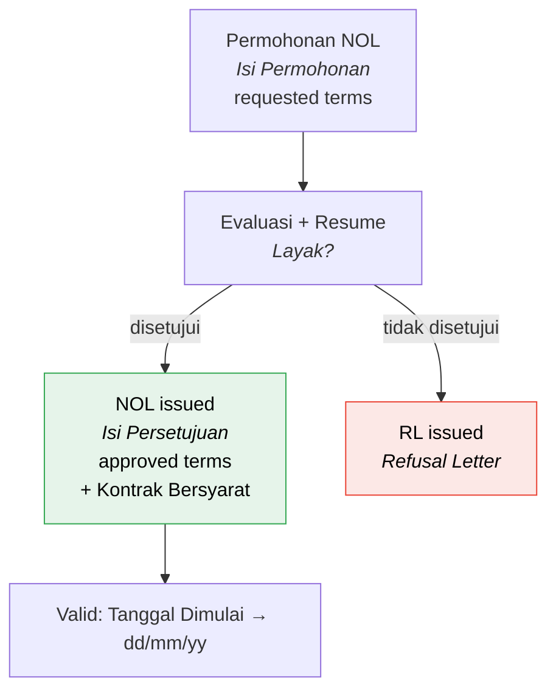

# Domain 06 — Stages 6–8: NOL

**NOL = No Objection Letter** (*Surat Pernyataan Tidak Keberatan*).
**RL = Refusal Letter.** The two are issued by the same act — a NOL request
always terminates in one or the other.

Confirmed verbatim on Lampiran 15:
> *"…sebagai bahan pertimbangan Bapak untuk menerbitkan **Surat Pernyataan Tidak
> Keberatan (No Objection Letter)** untuk calon Pelanggan / Pelanggan tersebut di
> atas."*

Four official documents span these three stages:

| Document | Lampiran | Produced by | Stage |
|---|---|---|---|
| Evaluasi Registrasi Berlangganan Gas | **17** (p.175–184) | Area | 6 |
| Permohonan NOL/RL (Nota Dinas) | **15** (p.169–170) | GM SOR / Area Head | 6 |
| Resume Evaluasi / Analisis | (p.185–186) | Fungsi Sales & Customer Management **Regional** | 7 |
| Penerbitan NOL/RL (Nota Dinas) | **16** (p.171–174) | Direktur Komersial / GM SOR | 8 |

---

## Stage 6 — Permohonan NOL

### Fields (`Entry Apps` rows 102–117)

#### Contract volumes — repeating periods

> *"jika ada lebih dari 1 periode maka bisa add row"* (`K102`)

| Field | Type | Note | Source |
|---|---|---|---|
| Source mode | radio | **`Sama dengan A1`** · `Entry` — copy from A1 or enter fresh | `D103`, `D104` |
| `Periode` from / `s.d` | date | *"Date"* comment on `G102` | `F102`, `H102` |
| `Rata-rata` | number | | `F103` |
| `Kontrak Minimum` | number | | `I103` |
| `Kontrak Maksimum` | number | | `K103` |
| `Permohonan Bulan dimulai` | date | *"(Pilihan Tanggal Calender)"* | `D106`, `I106` |

The `Sama dengan A1` toggle is a real requirement, not a convenience: it records
*whether the NOL request matches what the customer applied for*. When it differs,
that difference is exactly what reviewers examine. Store the flag, not just the
resulting values.

Note the vocabulary shift from A1: `Minimum`/`Maksimum` become **`Kontrak
Minimum`**/**`Kontrak Maksimum`** — these are now contractual commitments.

#### Pricing — same structure as A1

| Field | Options | Source |
|---|---|---|
| `Basis Kontrak` | `Harian` · `Bulanan` · `Tahunan` | `F108`, `H108`, `J108` |
| `Skema` | `Reguler` · `SiGas` · `Bersyarat` | `F109`, `H109`, `J109` |
| `Segment` | Bronze 1–3 / Silver / Gold / Platinum (dropdown, comment on `L108`) | `K108` |
| `Kode Harga` | text/select | `K109` |
| `Harga` | number + currency + unit | typed directly |

`F110` carries the *"Sesuai Data base"* comment, same as A1's `F95` — but that
automatic path was never built, so the comment describes a lookup that
doesn't exist. `OUP`/`UMP` (`F111`, `H111`) are dropped for the same reason
they are at A1: they fed a formula that no source ever defined.

Stage 6 never had a `Manual`/`Otomatis` toggle to begin with — it was always
forced to one mode. That mode has simply flipped from `Otomatis` to manual,
the same way A1 lost its toggle: there's only one behaviour left, so nothing
to switch between.

#### Costs and attachments

| Field | Type | Source |
|---|---|---|
| `Biaya Capex Pre GR3` | number + `Upload` | `D113`, `K113` |
| `Biaya Penyambungan — Reguler` | number | `F115` |
| `Biaya Penyambungan — Extra` | number | `F116` |
| `Biaya Penyambungan — Jumlah` | number, **calculated** = Reguler + Extra | `F117` |
| Attachment 1 | `A1` | `K114` |
| Attachment 2 | `KK0` | `K115` |

`Biaya Penyambungan` on Lampiran 17 §7 is expressed as *"Rp <<Nilai Biaya
Penyambungan>> (Belum termasuk PPN)"* — **excluding VAT**. Label it that way.

### Document: Permohonan NOL/RL (Lampiran 15)

A **Nota Dinas**:

| Field | Value |
|---|---|
| `Nomor` | generated |
| `Yang Terhormat` | Direktur Komersial / General Manager, Sales and Operation Region (I/II/III/IV) |
| `Dari` | General Manager, Sales and Operation Region (I/II/III/IV) / Area Head |
| `Hal` | Permohonan Penerbitan NOL/RL untuk Registrasi Berlangganan Gas / Amendemen Perjanjian PT …… |
| `Sifat` | Segera |
| `Lampiran` | 1 (satu) berkas |
| `Menunjuk` | 3 numbered reference lines — **dropdown of known documents *or* free text** ([annotation](../source/extracts/annotations.txt), image 9) |

Then the customer data block: `Nama Perusahaan`, `Nama Pimpinan Perusahaan`,
`Alamat Kantor`, `Alamat Pabrik`, `Produksi Utama`, `Jangka waktu kontrak`, and
`Isi Permohonan Berlangganan Gas / Amendemen Perjanjian`, which branches by
contract basis, then `Alasan Kontrak Bersyarat : (jika ada)`.

The client marked that whole customer block **`Otomasi Data Tersedia`** — *automate
from data already held*. Nothing in it is typed on this form; every field comes
from the record. `Isi Permohonan` is the exception and is marked separately:
*"Memilih Produk : Harian, Bulanan, Tahunan / Memilih : Reguler / Bersyarat /
Bersyarat : Sebutkan Term Bersyaratya dan alasan"* — three choices, and a required
reason when `Bersyarat` is picked.

Signed by **General Manager, Sales and Operation Region… / Area Head**.

Two fields here are **not** in the worksheet and must be added:
`Nama Pimpinan Perusahaan` and `Jangka waktu kontrak`. `Alamat Pabrik` maps to
KK0's `Lokasi Pemasangan`.

### Daily contract basis

When `Basis Kontrak = Harian`, Lampiran 15/16 require a **7-row weekday table**
instead of a single min/max:

| No. | Nama Hari | Pemakaian Minimum m³/MMBtu per Hari Kontrak | Pemakaian Maksimum m³/MMBtu per Hari Kontrak |
|---|---|---|---|
| 1 | Senin | | |
| 2 | Selasa | | |
| 3 | Rabu | | |
| 4 | Kamis | | |
| 5 | Jum'at | | |
| 6 | Sabtu | | |
| 7 | Minggu | | |

Plus `Hari Kerja, Jam Operasi`, `Tekanan` (Po … s.d Po … barg) and `Harga Gas`
per period. This weekday table appears **nowhere in the client's worksheet** and
is easy to miss.

🚧 `nol_request_daily` (7 rows) is in the schema; the UI is hidden unless
`basis_kontrak = harian` and is not built in v1 pending confirmation that `Harian`
is used at all — see [docs/future](../future/README.md#daily-contract-basis-harian).

---

## Stage 7 — Evaluasi NOL

Owned by **Regional Admin**, not the Area:

> *data analisis kelayakan posisinya di regional admin*
> *bagian regional melengkapi data yang sudah diinput dari area*

This is where the ownership handover happens. The Area's involvement ended when
the Area Head approved Lampiran 17; Regional Admin now completes the data and
produces the Resume Evaluasi. See
[approval-workflow.md](../design/approval-workflow.md#area-heads-endpoint).

### FEED checkpoint

*Diagram Alir 6.1* step 3b.i has *Fungsi Infrastruktur* preparing the **FEED**
(*Front End Engineering Design*) before the feasibility analysis. FEED establishes
the pipe routing, MRS location and specification, and the capex estimate — i.e. it
produces the numbers Gate Review reviews and that land in the fields below.

The system does *not* model the FEED process, only a checkpoint:

| Field | Type |
|---|---|
| `feed_status` | `belum` · `dalam_proses` · `selesai` |
| `feed_completed_at` | date, null |
| `feed_document` | attachment, null |

Regional Admin cannot complete the feasibility analysis until FEED is done, so
this status is a real blocker and belongs on the timeline.

### Fields (`Entry Apps` rows 119–129)

| Field | Type | Note | Source |
|---|---|---|---|
| `Capex - data Final` | number | | `D119` |
| `Pipa Induk` — panjang | number `m` | | `D120`, `G120` |
| `Pipa Induk` — diameter | number `Inch/mm` | *"Drop down"* on unit (`I120`) | `I120` |
| `Pipa Service` — panjang | number `m` | | `D121`, `G121` |
| `Pipa Service` — diameter | number `Inch/mm` | | `I121` |
| `Spesifikasi MRS` | text | | `D122` |
| `G.Size` | select | example `65` | `D124`, `F124` |
| `Tekanan` | number | example `1` | `G124` |
| `Maks Flowrate` | number | example `200` | `H124` |
| `Internal Rate of Return (IRR)` | percent | | `F127` |
| `Net Present Value (NPV)` | currency | | `F128` |
| `Payback Period` | years | | `F129` |

### Document: Lampiran 17 — Evaluasi Registrasi Berlangganan Gas

Full title: *EVALUASI DAN ANALISIS REGISTRASI BERLANGGANAN GAS / PERUBAHAN
PERJANJIAN*. Numbered sections:

**§1 Data calon Pelanggan / Pelanggan** — footnote 14: *"Pilih salah satu. Calon
Pelanggan: untuk registrasi berlangganan; Pelanggan untuk perpanjangan atau
amandemen."*

| Field | Values |
|---|---|
| Nama Perusahaan | |
| Alamat | |
| Lokasi Pemasangan | |
| **Surat Registrasi** | Nomor + tanggal |
| **Status** | ☐ Calon Pelanggan ☐ Eks Pelanggan |
| Basis Kontrak | ☐ Bulanan ☐ Tahunan |
| **Skema Pembayaran** | Jaminan Pembayaran / Pembayaran Dimuka |
| Perkiraan Bulan Dimulai | |
| **Jangka Waktu Perjanjian** | … tahun terhitung sejak dd-mm-yyyy s.d dd-mm-yyyy |
| Volume Pemakaian Gas | Berlaku sejak … s.d …; Pemakaian Minimum/Maksimum `<<m3 atau MMBtu>>/<<Bulan atau Tahun Kontrak>>` |
| **Sub-Produk** | Bronze 1/Bronze 2/Bronze 3/Silver/Gold/Platinum |
| **Kebutuhan Tekanan** | `<<Po>> (<<huruf>>) s.d <<Po>> (<<huruf>>) barg` |
| Harga Gas | `<<kode harga>>` USD…/MMBtu atau Rp…/m³ |

Then a repeating ramp-up block (*"Jumlah periode dapat disesuaikan dengan rencana
ramp up"*), and:

**§4 (payment)** — Skema pembayaran · Pembayaran Dimuka (Nilai) · Jaminan
pembayaran (Status Ada/Tidak Ada, Jenis, Masa berlaku, Nama pihak penerbit) ·
Kesimpulan

**§5 Analisis komersial Pelanggan** — Pendapatan (Potensi: Kenaikan/Penurunan
Pendapatan; Nilai … per Bulan) · Kesimpulan

**§6 Analisis kompetisi/bahan bakar subtitusi** — Nama Kompetitor/Jenis bahan
bakar subtitusi · **Radius Kompetitor (Km)** · Volume dari Kompetitor · Keunggulan
kompetitor · Harga bahan bakar kompetitor · Kesimpulan

**§7 Biaya Penyambungan** — *"Rp <<Nilai>> (Belum termasuk PPN)"*

**§8 Spread sheet Peralatan Gas** — 24-hour equipment load profile for meter
sizing — image/document upload. **Deliberately against the client's own
marker**: they wrote `Entry Data` here vs. `Upload Gambar` on §9–11
([annotations.txt](../source/extracts/annotations.txt)), i.e. key in rather
than scan. v1 does the opposite because nothing downstream reads the
figures — `g_size`/`maks_flowrate` on the evaluation are typed by Regional
Admin independently, with no link back to this upload
([frontend/07](../design/frontend/07-evaluation-and-issuance.md#gate-review-data)).
Worth confirming with PGN, since it's a direct reversal of their marker.

**§9 Gambar Rencana/Situasi Pabrik**, Rencana Pipa PGN Di Dalam Pabrik, Lokasi
MRS, dan Pipa Instalasi — image upload

**§10 Gambar Situasi Pipa Eksisting**, Rencana Pipa Ke Lokasi Calon Pelanggan,
dan Potensi Sekitar Pabrik — image upload

**§11 Usulan Titik Taping dan Keandalan Jaringan** — image/description upload

Sections 9–11 match the docx annotations *"Upload Gambar"* and *"Entry: Deskripsi
dan Upload Tabel"*.

### Document: Resume Evaluasi / Analisis

Prepared by **Fungsi Sales & Customer Management Regional** — this is the
*"output dari hasil review adalah resume evaluasi"* from the notulen.

**#Untuk calon Pelanggan → I. Data Pendukung**

| § | Content |
|---|---|
| 1 | **Status Capel di RKAP** — *"Calon Pelanggan merupakan Capel RKAP/Non RKAP di Area…"* |
| 2 | **Status JP** — payment guarantee provided if approved |
| 3 | **Target tandatangan PJBG** — commitment to sign promptly |
| 4 | **Gate Review** — results between fungsi komersial, operasi dan infrastruktur, on date … |
| 5 | **Analisis pasokan** — `Ketersediaan Pasokan`, a manual figure in **BBTUD** typed in for this case |
| 6 | **Analisis kelayakan** — scheme + price |
| 7 | **Analisis Kompetitor** — *"Capel berada/tidak berada di zona kompetitor dengan radius…"* |
| 8 | **Lain-lain** |

§4 Gate Review table:

| Row | Unit |
|---|---|
| Total Nilai Capex | Rp |
| Pipa Induk/Pipa Cabang | Panjang… Diameter… *(footnote 43: fill if there is a main/branch pipe)* |
| Pipa Servis | Panjang… Diameter… |
| **G-Size MR/S** | |
| **Durasi Pelaksanaan** | … Bulan sejak PJBG diterima PMO |
| **Maksimum Kapasitas Meter** | … m³/jam |

§6 feasibility table — **two price scenarios side by side**:

| Indikator | Harga … | Harga … |
|---|---|---|
| Internal Rate of Return (%) | | |
| Pay Back Period (Tahun) | | |
| Hasil Analisis | | |

**Note: the official resume has IRR and Payback only — no NPV**, while
`Entry Apps!F128` includes NPV. Keep NPV as an internal field; it does not print
on the resume.

🚧 The **two-column price comparison** means the system should evaluate two price
scenarios, which the worksheet does not model. `nol_evaluation_scenario` is a
child table from the start; the UI renders one scenario in v1, so going to two is
a UI change rather than a migration — see
[docs/future](../future/README.md#two-scenario-feasibility-comparison).

**#Untuk Pelanggan** (for existing customers — amendments/extensions):
1. Latar Belakang · Penyebab Perubahan · Kondisi Kompetisi
2. Analisis Komersial — *Review realisasi pemakaian Gas 6 (enam) bulan terakhir* · Review pasokan Gas
3. Analisis Teknis — Meter/perubahan Meter · Pipa Instalasi
4. Analisis Finansial

**II. Hasil Analisis** — *"maka Registrasi Berlangganan/Perubahan
Perjanjian/Perpanjangan Perjanjian dari PT … dapat disetujui/ditolak."*

Signed: *Disiapkan oleh, <<Nama Jabatan Fungsi Sales & Customer Management Regional>>*.

🚧 **This confirms a second workflow variant** the client hasn't discussed:
amendment/extension for *existing* customers, not just new registration. Treated
as **out of scope for v1**, but `nol_request.registration_type`
(`registrasi_baru` | `amendemen` | `perpanjangan`) is added now, defaulting to
`registrasi_baru` — cheap insurance against a later migration on a table holding
signed documents. See [docs/future](../future/README.md#amendment--extension-workflow).

---

## Stage 8 — Persetujuan NOL

### Document: Penerbitan NOL/RL (Lampiran 16)

A Nota Dinas mirroring Lampiran 15, with the decisive clause:

> *"dengan ini kami menyatakan **menyetujui / tidak menyetujui** \*) atas
> Registrasi Berlangganan Gas / Amendemen Perjanjian…"*

and closing:

> *"Untuk selanjutnya, dengan terbitnya **No Objection Letter / Refusal Letter**
> \*) ini, maka permohonan calon Pelanggan / Pelanggan tersebut **dapat/tidak
> dapat** \*) diproses lebih lanjut sesuai dengan ketentuan dan prosedur yang
> berlaku"*

Extra fields vs Lampiran 15:

| Field | Note |
|---|---|
| `Isi Persetujuan Berlangganan Gas / Amendemen Perjanjian` | The **approved** terms — may differ from what was requested |
| `Kontrak Bersyarat:` 1. … 2. … | Numbered conditions attached to approval *(jika ada)* |
| Validity | *"Persetujuan ini berlaku terhitung sejak Tanggal Dimulai sampai dengan <<dd/mm/yy>>"* |

Signed by **Direktur Sales dan Operasi / General Manager, Sales and Operation
Region …**.

That `Isi Persetujuan` block is important: **approval can modify the terms.** The
data model needs requested terms and approved terms as separate records, not one
mutable set. See [data-model.md](../design/data-model.md).

---

## Reference documents — two places, two behaviours

`reference_document` is consumed twice, and the client annotated each occurrence
differently. They are **not the same control**.

**1 · Nota Dinas `Menunjuk:` — Lampiran 15, p169**

Three numbered citation lines at the head of the request. Annotation:
*"Drop Down Daftar Dokumen dan atau Entry manual"* — pick from the known list
**or type one in**. The escape hatch is explicit, so this is a combo box, not a
closed dropdown, and free-typed entries must be storable without first creating a
master row.

**2 · Resume Evaluasi §8 `Lain-lain` — p186**

Annotation: *"LAIN-LAIN / Entry : Pilih Upload Dokumen Acuan Kerja"*, followed by
the five named policy documents:

- Ketentuan Produk-Sub Produk, Segmentasi
- Ketentuan Harga Gas
- Ketentuan Biaya Penyambungan
- Ketentuan Jaminan Pembayaran
- Ketentuan Biaya Sewa Lahan

A **multi-select of those five with their attached files** — *pilih* and *upload*,
not free text. These are the policies that govern the decision, and attaching the
applicable version is what makes the decision auditable years later.

Model as one `reference_document` master table with versioning, surfaced as a
combo box in case 1 and a checklist in case 2.

**Ketentuan Biaya Sewa Lahan** (land rent) implies a land-rent cost element that
appears nowhere else in any source. There is no cost field for it — it exists
as a reference document only.
